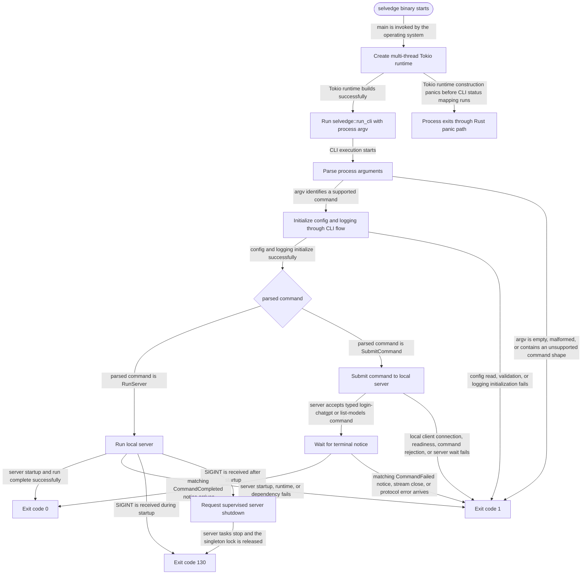

# Selvedge

<!-- selvedge-package-readme
package: selvedge
freshness_fingerprint: cb74caa5b30d33c2deadd7470b3e1a087ac7c495
-->

Selvedge runs a local server for persistent AI tasks. It stores task history in SQLite, routes commands and streamed updates to local clients, and executes model calls and tools through a task-owned runtime.

## Repository navigation

Read each package README before changing its behavior. Start with the boundary relevant to your change:

- [server](crates/server/README.md) and [web](crates/web/README.md): startup, local commands, and HTTP delivery.
- [core](crates/core/README.md), [db](crates/db/README.md), and [harness](crates/harness/README.md): durable task execution, persistence, and tools.
- [model-providers](crates/model-providers/README.md): model request adapters and provider selection.
- [local-client](crates/local-client/README.md) and [tui](crates/tui/README.md): local protocol access and terminal interaction.
- [config](crates/config/README.md): runtime configuration and storage paths.
- [xtask](xtask/README.md): repository checks and documentation maintenance.

[AGENTS.md](AGENTS.md) contains the complete tracked-file index and repository policies. Architectural decisions are recorded in [docs/adr](docs/adr).

## Quickstart

```bash
just run
just test
```

`just run` starts the local server. `Ctrl-C` exits with status 130 after cancelling an in-progress startup or supervising a running server to shutdown, including releasing the singleton lock in either phase.

Server startup builds the current harness and MCP runtime catalog, reconciles existing tasks' unavailable-tool sets without changing their frozen tool definitions, and requests recovery for every active durable task. The current CLI still supplies no model profiles and does not provision a root task, so those remain separate prerequisites for a model-driven production session.

## Development setup

```bash
./scripts/bootstrap.sh
```

Run this once in a clean Ubuntu environment. It installs the Rust toolchain, `just`, `pre-commit`, and the repository hooks. When run as a non-root user, it will prompt for `sudo` during package installation.

## Common commands

```bash
just fmt
just check
just hooks
just agents-index
just readme-freshness
```

Use `just agents-index` after adding, removing, or renaming tracked files so the project index in `AGENTS.md` stays current. Use `just agents-index-check` to verify that the index is up to date without rewriting the file. The index is built from Git-tracked files, so ignored and untracked files stay out automatically. Both commands warn when an indexed directory has an unusually large number of direct filesystem entries.

The underlying repository commands are `cargo xtask agents-index update` and `cargo xtask agents-index check`.

## Package State Machine

The diagram records the root package observable states and transition paths. Each edge label names the concrete condition checked at this package boundary.



See [CONTRIBUTING.md](./CONTRIBUTING.md) for the contribution workflow and pull request expectations.
