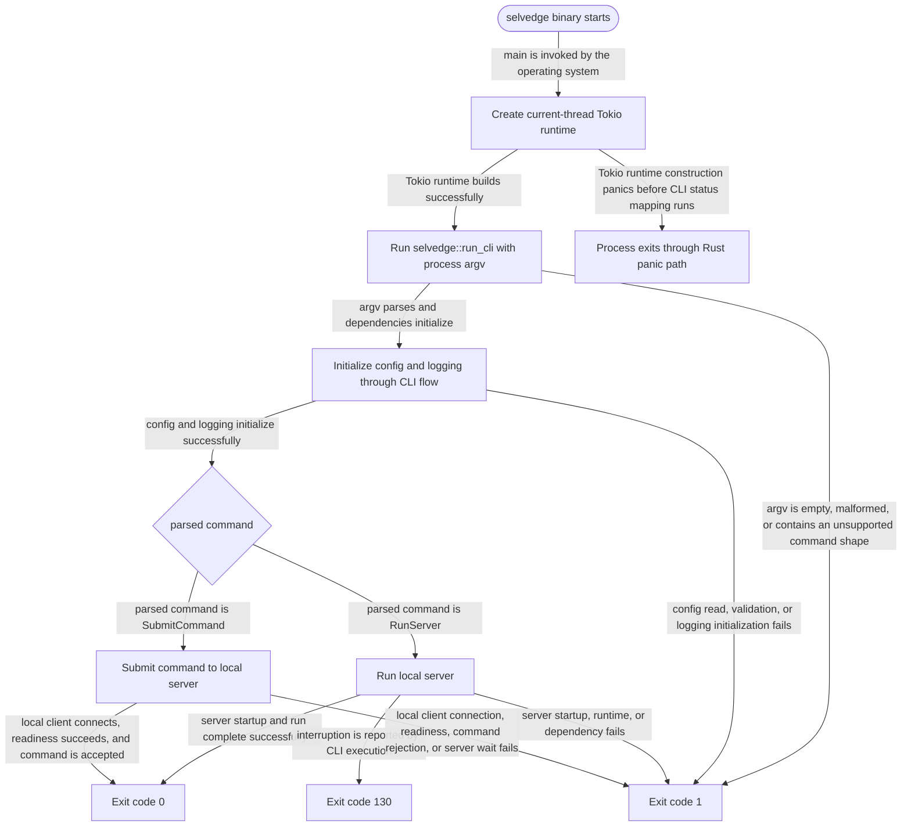

# Selvedge

<!-- selvedge-package-readme
package: selvedge
freshness_commit: 93d6358655f7d9e99af1d58ba0921f97fdb1afb2
-->

Selvedge is a Rust repository scaffold with a clean local development flow, pre-commit hooks, and GitHub Actions CI.

## What is included

- Cargo binary crate with a small library surface for testing
- `Justfile` shortcuts for bootstrap, formatting, lint, test, and hook execution
- A dedicated `cargo xtask` command for AGENTS.md project-index maintenance
- A dedicated `cargo xtask req` command family for source-comment requirement checks
- Root `AGENTS.md` guidance for coding agents, including a repository file index
- `rust-toolchain.toml` to keep the repository on the stable toolchain
- `.pre-commit-config.yaml` for formatting, lint, project-index, and test checks
- GitHub Actions CI for `fmt`, `clippy`, and `test`
- Basic repository hygiene files such as `.gitignore` and `.editorconfig`

## Quickstart

```bash
just run
just test
```

## Development setup

```bash
./scripts/bootstrap.sh
```

Run this once in a clean Ubuntu environment. It installs the Rust toolchain, `just`, `pre-commit`, and the repository hooks. When run as a non-root user, it will prompt for `sudo` during package installation.

## Common commands

```bash
just fmt
just check
just hooks
just agents-index
just req-check
just worktree feature/my-change
```

Use `just agents-index` after adding, removing, or renaming tracked files so the project index in `AGENTS.md` stays current. Use `just agents-index-check` to verify that the index is up to date without rewriting the file. The index is built from Git-tracked files, so ignored and untracked files stay out automatically. Both commands warn when an indexed directory has an unusually large number of direct filesystem entries.

The underlying repository commands are `cargo xtask agents-index update` and `cargo xtask agents-index check`.

Use `cargo xtask req fmt-agents` after changing requirement comments so the generated requirement index in `AGENTS.md` stays current. Use `cargo xtask req check --all` to validate every tracked Rust source line in the checkout against nearby requirement anchors, `cargo xtask req check --staged` for staged hunk validation, and `cargo xtask req check --base <git-ref>` for merge-base hunk validation.

## Package State Machine

The diagram records the root package observable states and transition paths. Each edge label names the concrete condition checked at this package boundary.



## Parallel development with worktrees

By default, create or switch branches in the repository root and work there. Only use worktrees when you explicitly want multi-branch parallel development.

In that parallel mode, keep the repository root on `main` and create one worktree per focused task:

```bash
just worktree feature/config-layering
```

The helper script creates a new branch from the current branch and a matching checkout under the current checkout's `.worktrees` namespace, using a stable hashed directory name derived from the branch name. `.worktrees/` is Git-ignored on purpose, so worktree contents stay out of the tracked checkout.

Run the command from the branch you want to branch off from. If you run it in the repository root on `main`, the new worktree is created under the root `.worktrees/`. If you run it inside an existing helper-managed worktree, the child worktree is created in that worktree's adjacent `.worktrees` storage instead of inside the parent checkout, so removing the parent worktree does not delete the child. The helper refuses to run from worktrees outside the repository root `.worktrees/` hierarchy. It also fails fast if `.worktrees/` is not ignored, if the branch already exists, or if the target worktree path already exists.

See [CONTRIBUTING.md](./CONTRIBUTING.md) for the contribution workflow and pull request expectations.
