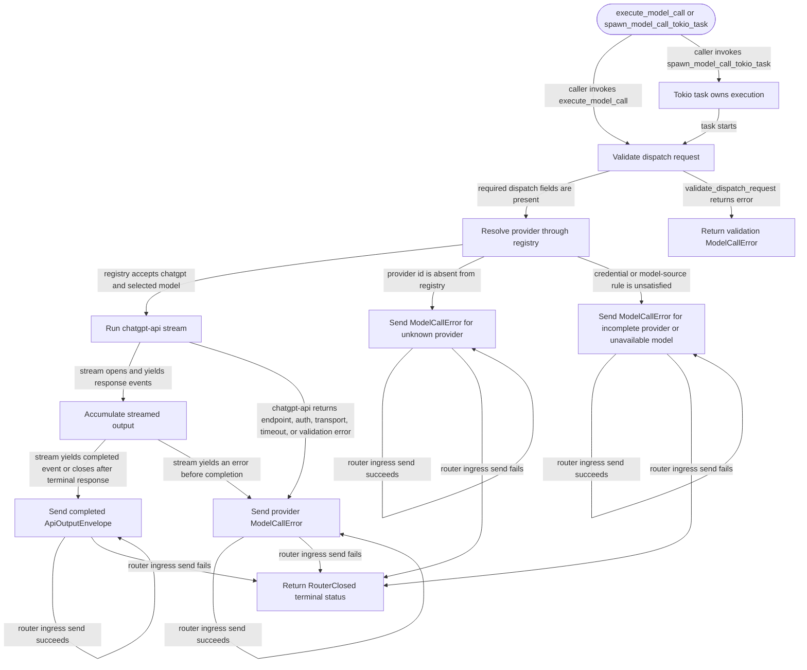

# api

<!-- selvedge-package-readme
package: selvedge-api
freshness_commit: 4df7c938dc791ae919322681e4c3b366888c755d
-->

This crate executes one Selvedge model call and returns the completed result to the router mailbox.

Use it to dispatch a single provider call, normalize the provider response into a model reply, classify execution failures, and spawn short-lived Tokio tasks for model calls.

The public entry point is `execute_model_call(request, router_tx, config)`. Provider selection comes from `request.provider.provider_name`; the provider registry validates the configured provider and selected model before the ChatGPT adapter executes ChatGPT requests.

For ChatGPT adapter dispatch, `request.provider.model_name` becomes the ChatGPT model. `request.provider.max_output_tokens` is accepted by the Selvedge request contract and ignored by this path because `chatgpt-api` exposes no request field for that control; ChatGPT `response.incomplete` with reason `max_output_tokens` returns `ModelFinishReason::Length` with accumulated output. ChatGPT dispatch pins ChatGPT capabilities to reasoning summaries enabled, text verbosity enabled, and default reasoning effort `medium` until Selvedge has a capability source.

This crate is not for database access, filesystem access, task creation, task runtime mutation, router registry mutation, retries, or persistence.

## Package State Machine

The diagram records the package-level observable states and transition paths. Each edge label names the concrete condition checked at this package boundary.

