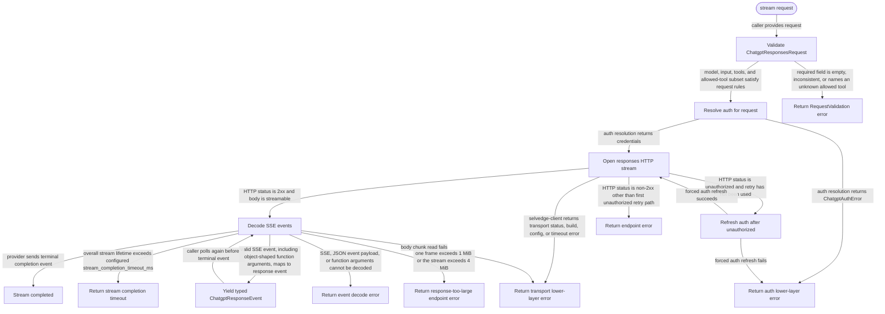

# chatgpt-api

<!-- selvedge-package-readme
package: chatgpt-api
freshness_fingerprint: 9677715812a5919b4228f4bc77dcd07947c30215
-->

## This crate is for

This crate implements ChatGPT `/responses` streaming calls for Selvedge.

Use it to:

- validate ChatGPT response-stream requests
- resolve ChatGPT auth fresh for each call
- open the `/responses` HTTP stream with bounded pre-stream retries
- decode SSE events into typed response events

## This crate is not for

This crate is not for:

- exposing a reusable client object
- caching config, auth, transcript, or turn state across calls
- persisting caller-visible state between requests
- hiding endpoint or transport failures behind fallback behavior

## Public API

Callers build a `ChatgptResponsesRequest` and pass it to `stream(...)`.

The returned `ChatgptResponseStream` yields `Result<ChatgptResponseEvent, ChatgptApiError>`.
Callers are responsible for preserving the full `input` history and the
`effective_turn_state()` value they want to replay on the next call.
`tools` carries the complete function descriptor set. Optional `allowed_tools`
selects a duplicate-free subset by name and is encoded as
`tool_choice.allowed_tools`; an empty subset encodes `tool_choice: "none"`
without deleting the descriptors.
`FunctionCallItem.arguments` is a `JsonObject`: this crate decodes the
provider's string-valued wire field at ingress and encodes it again only when
building a replay request. Arbitrary-precision JSON numbers therefore remain
lossless across provider normalization and replay.

## Config

This crate reads:

```toml
[llm.providers.chatgpt]
base_url = "https://chatgpt.com/backend-api/codex"
stream_completion_timeout_ms = 1800000
```

`base_url` is the upstream ChatGPT API base URL. `stream_completion_timeout_ms`
caps the total lifetime of a single successful response stream.

The decoder caps one pending SSE frame at 1 MiB and the complete response stream at 4 MiB. Either boundary returns `ChatgptApiEndpointError::ResponseTooLarge`.

## Timeout Semantics

This crate enforces two independent timeout layers:

- `network.stream_idle_timeout_ms` belongs to `selvedge-client` and limits how
  long one body-chunk wait may stay idle.
- `llm.providers.chatgpt.stream_completion_timeout_ms` belongs to this crate
  and limits the total lifetime of one `/responses` stream.

These settings are intentionally separate and are not merged into one budget.
Both constraints apply to the same request at the same time.

Failure precedence is simple:

- if the transport layer waits too long for the next body bytes,
  `selvedge-client` returns `HttpError::Timeout`
- if the overall `/responses` stream lives too long,
  this crate returns `ChatgptApiLowerLayerError::StreamCompletionTimeout`

Whichever timeout fires first ends the stream first. Callers should therefore
treat the client-layer timeout and the API-layer completion timeout as distinct
failure modes rather than aliases.

## Package State Machine

The diagram records the package-level observable states and transition paths. Each edge label names the concrete condition checked at this package boundary.


