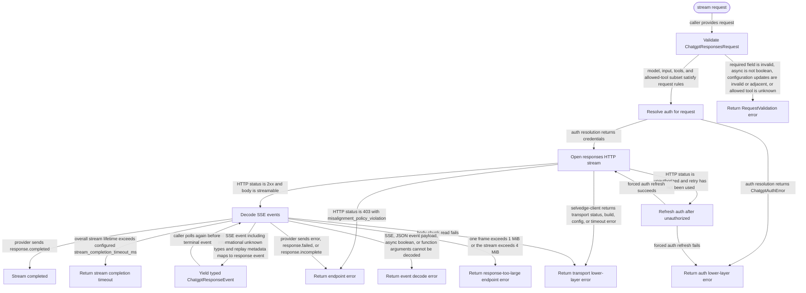
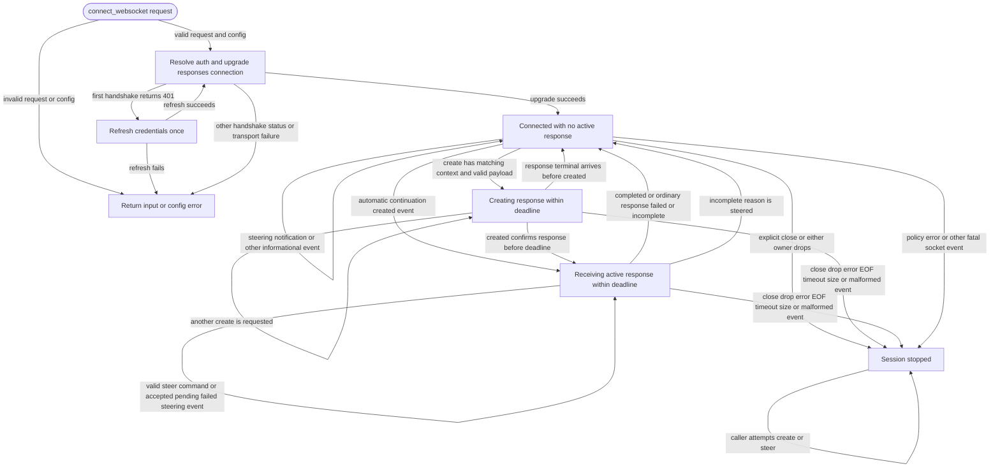

# chatgpt-api

<!-- selvedge-package-readme
package: chatgpt-api
freshness_fingerprint: 3761a73577a48c8d871d074175acea1ec5911c24
-->

## This crate is for

This crate implements ChatGPT `/responses` calls over HTTP SSE and caller-owned
WebSocket connections for Selvedge.

Use it to:

- validate ChatGPT response-stream requests
- resolve ChatGPT auth fresh for each call
- open the `/responses` HTTP stream with bounded pre-stream retries
- decode SSE events into typed response events
- send WebSocket response and steering commands while receiving typed events

## This crate is not for

This crate is not for:

- maintaining hidden reusable sessions or global conversation state
- owning caller transcripts, pending tools, or steering recovery
- persisting caller-visible state between requests
- hiding endpoint or transport failures behind fallback behavior

## Public API

For HTTP, callers build a `ChatgptResponsesRequest` and pass it to `stream(...)`.
For an explicit WebSocket connection, use `websocket::connect_websocket(...)` as
described below.

The returned `ChatgptResponseStream` yields `Result<ChatgptResponseEvent, ChatgptApiError>`.
Callers are responsible for preserving the full `input` history and the
`effective_turn_state()` value they want to replay on the next call.
`tools` carries the complete function descriptor set. Optional `allowed_tools`
selects a duplicate-free subset by name and is encoded as
`tool_choice.allowed_tools`; an empty subset encodes `tool_choice: "none"`
without deleting the descriptors.
`FunctionCallItem.arguments` is a `JsonObject`: this crate decodes the
provider's string-valued wire field at ingress and encodes it again only when
building a replay request. Arbitrary-precision JSON numbers therefore remain
lossless across provider normalization and replay.

Request encoding follows Codex commit `e269f2164cbb9f499e4f22301c393500e2a831f3`:
`session-id`, `thread-id`, and `x-client-request-id` use the caller's conversation
identity; `client_metadata` includes available session, thread, window,
installation, subagent, parent, and turn metadata. This API currently has one
conversation identity, so its session and thread identifiers are equal.
Reasoning effort and encrypted-content inclusion are independent of summary
support. Unsupported summary and verbosity controls are omitted; output schemas
remain available when verbosity is unsupported. A summary setting of `none`
omits the summary parameter.

Typed replay preserves message `phase`,
`internal_chat_message_metadata_passthrough`, function `encrypted_function_args`,
and input-image URL or file references with their `detail`. Callers must retain
these response items themselves. Unknown item and content types remain opaque;
that preservation does not add tool execution support. The provider-neutral
`selvedge-api` history does not persist phase, reasoning/encrypted metadata, or
the effective turn state, so these replay guarantees apply to direct callers of
this crate, not to the full durable Selvedge conversation path.

GPT-6 Astra async tool calling uses the `async` boolean in function and custom
tool descriptors. Descriptors preserve it unchanged; function calls expose it as
`FunctionCallItem.asynchronous` and `PendingFunctionCallItem.asynchronous`, while
custom calls preserve it in their opaque JSON. Missing, false, and true remain
distinct on replay. Non-boolean flags are rejected in descriptors and known
function/custom call items. The flag describes provider behavior; callers still
own tool execution and return results with the original `call_id`.

`ResponseItem::ConfigurationUpdate` changes reasoning effort at its position in
conversation history. `ConfigurationReasoningEffort` supports `low`, `medium`,
`high`, `xhigh`, and `max`. Encoding preserves the request-level reasoning effort
for prompt-prefix caching. Replay updates at their original positions; validation
rejects adjacent updates and updates containing fields other than
`reasoning.effort`, including updates supplied as opaque JSON. Model and mode
eligibility remain service-side checks: the upstream API supports configuration
updates only for GPT-6 Astra in standard, single-agent mode, without automatic
compaction or truncation. This crate does not enable those automatic operations.

These additions follow the official [async tool calling](https://developers.openai.com/api/docs/guides/async-tool-calling)
and [reasoning configuration updates](https://developers.openai.com/api/docs/guides/reasoning#change-reasoning-mid-conversation)
contracts. They extend the direct API contract; the provider-neutral durable
conversation path does not yet preserve async flags or configuration updates.

Informational SSE events with unknown types are yielded as `Other` and do not
terminate the stream. Explicit `error`, `response.failed`, and
`response.incomplete` events do terminate it; `response.completed` is the success
terminal, and EOF without it remains an error. Failure categories distinguish
current policy, overload, and rate-limit codes while retaining raw provider
details and retry delays. Usage exposes cache-write tokens and preserves
fractional `codex_rollout_budget_units` without rounding.
HTTP 403 with `misalignment_policy_violation` and the same code in a stream both
produce `MisalignmentPolicyViolation`, without automatic retries. The HTTP case
retains `http_status`; both retain the provider's code and raw details. Stream
failures remain terminal even after output has already been delivered.

## WebSocket responses and mid-turn steering

Steering commands and events follow the official
[mid-turn steering contract](https://developers.openai.com/api/docs/guides/steering).

`websocket::connect_websocket(&initial_request)` opens a caller-owned `/responses`
WebSocket using the same configuration, authentication, request validation, and
context headers as HTTP. Connecting does not send a response request. Consume
the returned session with `split()` to obtain a command sender and event receiver;
`sender.create(&request, previous_response_id)` sends `response.create`,
`sender.steer(&ChatgptSteerRequest)` sends `response.steer`, and
`events.next().await` receives `ChatgptWebSocketEvent`. Reading events and sending
commands can proceed concurrently. The connection permits one active response;
a conflicting create returns `ResponseInProgress` without sending anything.

Every create must retain the complete original handshake `context`; changing it
returns an input error. `effective_turn_state()` exposes the upgrade header for
future connections or HTTP calls, not for replacing this connection's frozen
context. When using `previous_response_id`, callers supply continuation input
for that response chain. The WebSocket create body reuses the HTTP request encoder, including
`stream: true`, and adds `type` plus an optional `previous_response_id`. No legacy
WebSocket beta header is injected. A 401 handshake can refresh credentials and
retry once. No other handshake failure retries, and established connections do
not reconnect, replay messages, or fall back to HTTP.

Construct steering input with `ChatgptSteerInput::text(...)` or the validated
`from_value(...)` constructor. Arrays must contain at least one user message
using text or supported `input_text`, `input_image`, and `input_file` content.
Unsupported message roles, extra command fields, and malformed content are
rejected before writing. The wire command contains only `type`,
`previous_response_id`, and `input`.

`SteerAccepted` identifies queued input; acceptance does not mean it has been
applied. A `Steered` event reports an incomplete response whose reason is
`steered`; keep receiving the server's automatic continuation. `SteerPending`
retains `required_input`: return the requested tool results or approvals with an
explicit create on the same socket, without resending the accepted steer.
`SteerFailed` retains the original input and full error object. All three steering
events retain their identities, sequence number, and raw payload. The caller owns
response IDs, pending steering, tool execution, and recovery decisions.

A completed response, ordinary `response.failed`, or ordinary incomplete response
ends that response and leaves the connection available. Response errors are
returned as `ChatgptWebSocketEvent::ResponseError`; failed steering leaves the
current response running. A top-level `error`, misalignment policy violation,
malformed event, unexpected conflicting response identity, transport failure,
EOF, or a size/completion limit ends the session and prevents further sends.
Fatal errors are yielded once after any queued events. A clean remote close is
reported as `PrematureClose`, since pending steering cannot be assumed to survive.

Each explicitly created response gets its own completion budget beginning at
send; confirming or repeated `response.created` does not renew it. An automatic
continuation starts a new budget on its created event. Between responses and
while waiting for caller input, the configured transport idle timeout applies
without a response completion timer. WebSocket messages are limited to 1 MiB;
response events are limited to 4 MiB per response, with steering notifications
excluded from that cumulative count. The 32-event queue applies backpressure;
waiting for a consumer remains cancellable and subject to the active response
budget. Cancelling an in-flight send ends the session because its delivery is
uncertain.

`sender.close()` sends a close frame even after a session error. Dropping either
half disables commands and stops background receiving; dropping both halves
releases the socket. A retained half still owns its transport resources.

This connection API does not wire steering or async tool scheduling into the
provider-neutral task runtime or its persistent history.

## Config

This crate reads:

```toml
[llm.providers.chatgpt]
base_url = "https://chatgpt.com/backend-api/codex"
stream_completion_timeout_ms = 1800000
```

`base_url` is the upstream ChatGPT API base URL. `stream_completion_timeout_ms`
caps the total lifetime of a single successful response stream.

The decoder caps one pending SSE frame at 1 MiB and the complete response stream at 4 MiB. Either boundary returns `ChatgptApiEndpointError::ResponseTooLarge`.

## Timeout Semantics

This crate enforces two independent timeout layers:

- `network.stream_idle_timeout_ms` belongs to `selvedge-client` and limits how
  long one body-chunk wait may stay idle.
- `llm.providers.chatgpt.stream_completion_timeout_ms` belongs to this crate
  and limits the total lifetime of one `/responses` stream.

These settings are intentionally separate and are not merged into one budget.
Both constraints apply to the same request at the same time.

Failure precedence is simple:

- if the transport layer waits too long for the next body bytes,
  `selvedge-client` returns `HttpError::Timeout`
- if the overall `/responses` stream lives too long,
  this crate returns `ChatgptApiLowerLayerError::StreamCompletionTimeout`

Whichever timeout fires first ends the stream first. Callers should therefore
treat the client-layer timeout and the API-layer completion timeout as distinct
failure modes rather than aliases.

## Package State Machine

The diagram records the package-level observable states and transition paths. Each edge label names the concrete condition checked at this package boundary.



The WebSocket connection has a separate multi-response lifetime:


