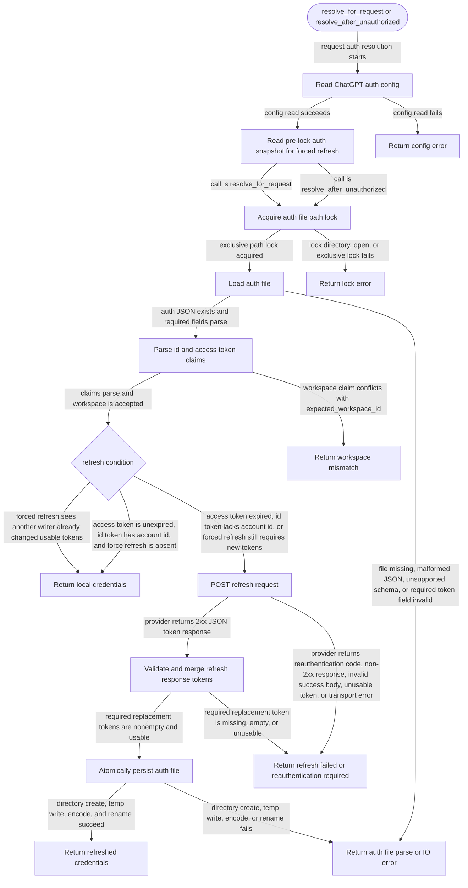

# chatgpt-auth

<!-- selvedge-package-readme
package: chatgpt-auth
freshness_commit: f2a0e6aa7f63b0fb8b575fefc5026e0535a7e64f
-->

This crate resolves ChatGPT auth state for request execution.

It exposes:

- `resolve_for_request()`
- `resolve_after_unauthorized()`
- `parse_auth_file(...)`
- `parse_chatgpt_jwt_claims(...)`

The crate reads ChatGPT auth config fresh for every call through
`selvedge_config`, uses `selvedge_client` for refresh HTTP requests, and reads
or atomically updates `<selvedge_home>/auth/chatgpt-auth.json`.

## Package State Machine

The diagram records the package-level observable states and transition paths. Each edge label names the concrete condition checked at this package boundary.

