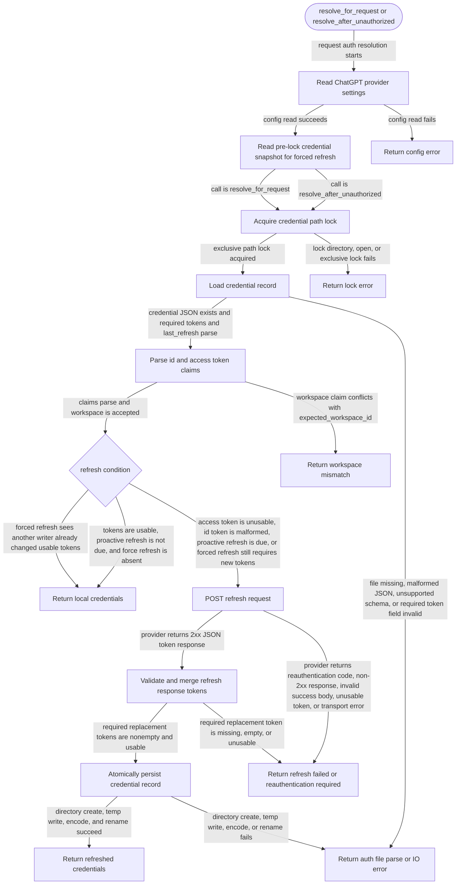

# chatgpt-auth

<!-- selvedge-package-readme
package: chatgpt-auth
freshness_fingerprint: 6f755cdbf6cbcae521f2f453e555414671fa49fc
-->

This crate resolves ChatGPT auth state for request execution.

It exposes:

- `resolve_for_request()`
- `resolve_after_unauthorized()`
- `parse_auth_file(...)`
- `parse_chatgpt_jwt_claims(...)`
- `read_chatgpt_auth_config()`
- `chatgpt_auth_file_path(...)`
- `persist_chatgpt_auth_file(...)`

The crate reads ChatGPT provider settings fresh for every call through
`selvedge_config`, uses `selvedge_client` for refresh HTTP requests, and reads
or atomically updates the `chatgpt` login credential record at
`<selvedge_home>/auth/model-providers/chatgpt.json`.

`chatgpt-login` reuses the config, claims, and token validation APIs.
`model-credentials` owns envelope decoding, paths, locking, and atomic writes.
The token writer requires a `CredentialLockGuard`; callers retain that guard
across refresh so another writer cannot replace the credential mid-refresh.
Invalid tokens leave the existing file unchanged.

The current ChatGPT credential payload requires `tokens` and an RFC3339
`last_refresh` timestamp. Login and successful refresh writes record the current
UTC time. Records without a valid timestamp fail validation and require a new
login; the reader does not migrate older records.

Access tokens with a readable JWT expiry refresh within five minutes of expiry.
Tokens without an expiry, including opaque tokens, refresh when `last_refresh`
is more than eight days old. JWT expiry takes precedence over that age fallback.
Refresh uses a JSON request body. A refresh HTTP 401 response or a recognized
terminal provider code requires reauthentication; diagnostics support both OAuth
string errors and nested `error.code` / `error.message` responses.

## Package State Machine

The diagram records the package-level observable states and transition paths. Each edge label names the concrete condition checked at this package boundary.

