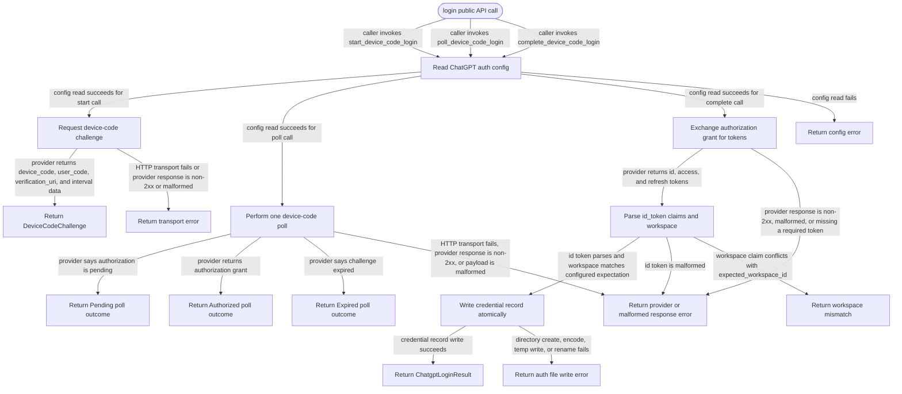

# chatgpt-login

<!-- selvedge-package-readme
package: chatgpt-login
freshness_commit: 2fa9c520489d3b42635b257a333e7fdee7a8a0ed
-->

## This crate is for

This crate implements the ChatGPT device-code login flow.

Use it to:

- start a device-code login challenge
- poll the provider for authorization state
- exchange the authorization grant for tokens
- persist the ChatGPT provider credential after a successful login

## This crate is not for

This crate is not for:

- exposing a reusable login client
- caching config or process-local login state across calls
- validating JWT signatures or fetching JWKS documents
- supporting providers other than ChatGPT

## Public API

Callers that want the whole product login flow use:

- `run_chatgpt_login(progress_sink)`

The operation starts the challenge, emits the user-code prompt through the
progress sink, polls until authorization or expiry, exchanges tokens, validates
claims, and persists the auth file before returning.

Lower-level tests and specialized callers may use three async functions:

- `start_device_code_login()`
- `poll_device_code_login(...)`
- `complete_device_code_login(...)`

The crate reads ChatGPT auth config fresh for every call through `selvedge_config`
and executes every HTTP request through `selvedge_client`.

## Runtime behavior

- `start_device_code_login()` reads the current `issuer` and `client_id`, then
  requests a new device-code challenge
- `poll_device_code_login(...)` performs exactly one poll and never loops
  internally
- `complete_device_code_login(...)` exchanges the authorization grant, parses
  claims from `id_token`, checks `expected_workspace_id` when configured, and
  writes the `chatgpt` login credential record atomically before returning
- `run_chatgpt_login(...)` serializes concurrent login operations in the current
  process and returns `LoginAlreadyRunning` when another login is active

## Challenge lifetime contract

`DeviceCodeChallenge::expires_at` is an API contract, not a reflection of any
provider-specific TTL field. This crate always sets `expires_at` to
`issued_at + 15 minutes`.

This behavior is intentional. It matches the repository-level public contract
for this crate, and callers may rely on that fixed lifetime when they interpret
`DeviceCodePollOutcome::Expired` or `ChatgptLoginError::ChallengeExpired`.

If the provider returns a different lifetime value, this crate does not surface
that value through the public API.

## Config

This crate reads:

```toml
[llm.providers.chatgpt.settings]
issuer = "https://auth.openai.com"
client_id = "app_EMoamEEZ73f0CkXaXp7hrann"
expected_workspace_id = "optional string"
```

## Package State Machine

The diagram records the package-level observable states and transition paths. Each edge label names the concrete condition checked at this package boundary.


