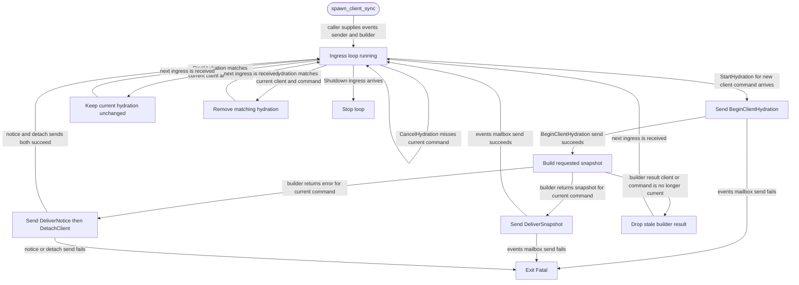

# client-sync

<!-- selvedge-package-readme
package: selvedge-client-sync
freshness_commit: d8515322d257e6d4c7941584a4d5a3f95e1ee3ec
-->

This crate defines the client hydration synchronization boundary used by the server and router attach path.

Use it to pass hydration starts, cancellation, shutdown signals, snapshot builder requests, snapshot builder results, client-sync errors, and the client-sync task handle across package boundaries.

## Hydration Model

`spawn_client_sync` starts one ingress loop. That loop owns the current hydration map keyed by `ClientId`; builder tasks only return snapshot results to the loop. This keeps replacement, cancellation, shutdown, and stale-result dropping in one ordering point.

`ClientSyncIngress::StartHydration` sends `BeginClientHydration` to the events mailbox first. Current-state snapshot building starts after that send succeeds. Empty snapshot mode delivers an empty snapshot without calling the builder. A closed events mailbox is a fatal client-sync exit, and the builder is left untouched for that request.

Only the current `(ClientId, ClientCommandId)` may deliver its builder result. A new command for the same client replaces the old command. A duplicate start for the current command is ignored. `CancelHydration` removes the matching current command. `Shutdown` stops the loop and drops late builder results.

Successful builder results are forwarded as `DeliverSnapshot` exactly as built. Builder errors are forwarded as an error `DeliverNotice` followed by `DetachClient` with `DetachReason::DeliveryFailed`. If either events send fails, the sync loop exits with `ClientSyncExitStatus::Fatal`.

## Package State Machine

The diagram records the package-level observable states and transition paths. Each edge label names the concrete condition checked at this package boundary.

