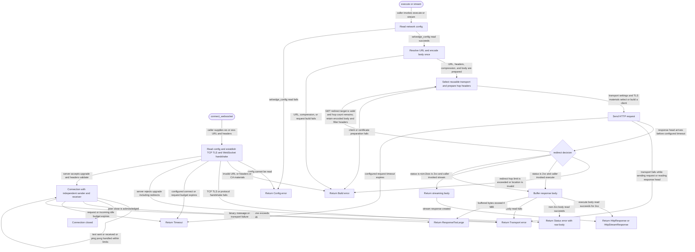

# client

<!-- selvedge-package-readme
package: selvedge-client
freshness_fingerprint: c7fe823667f385bf6569fe9c619743df0ee41849
-->

## This crate is for

This crate is the project HTTP and WebSocket client entrypoint.

Use it to:

- execute one-shot HTTP requests through `execute(...)`
- execute streaming HTTP requests through `stream(...)`
- open authenticated text WebSockets through `connect_websocket(...)`
- read `network.*` config fresh for every call
- emit structured transport logs through `selvedge_logging`

## This crate is not for

This crate is not for:

- exposing a reusable client object
- caching mutable config or per-request derived state
- retrying requests implicitly
- parsing response bodies into JSON, SSE, or auth-specific models

## Call model

Callers build an `HttpRequest` value and pass it to one of two functions:

- `execute(...)` for full-body responses
- `stream(...)` for raw byte streams

```no_run
use http::HeaderMap;
use selvedge_client::{
    HttpMethod, HttpRequest, HttpRequestBody, RequestCompression, execute,
};

# #[tokio::main(flavor = "current_thread")]
# async fn main() -> Result<(), Box<dyn std::error::Error>> {
let response = execute(HttpRequest {
    method: HttpMethod::Post,
    url: "https://example.com/endpoint".to_owned(),
    headers: HeaderMap::new(),
    body: HttpRequestBody::Json(serde_json::json!({ "x": 1 })),
    timeout: None,
    compression: RequestCompression::None,
})
.await?;

assert!(response.status.is_success());
# Ok(())
# }
```

## Runtime and config

- callers must initialize `selvedge_config` before using this crate
- callers must run these async functions inside a Tokio runtime
- every call reads `network.*` config immediately through `selvedge_config::read`
- the most recent immutable transport settings (connect timeout and CA bundle contents) retain a reusable connection pool; different settings replace the retained pool while in-flight calls keep their own transport
- a call reads the CA bundle at its first HTTPS hop and reuses that snapshot for later HTTPS redirects; changes at the same path apply on the next call, and HTTP calls ignore the CA path
- request timeouts and User-Agent remain per-call settings and do not prevent connection reuse
- this crate does not support outbound proxies and intentionally ignores environment proxy settings such as `HTTP_PROXY` and `HTTPS_PROXY`
- `request.timeout` overrides `network.request_timeout_ms` only for that call
- `network.request_timeout_ms` is optional; when it is unset and no per-call timeout is supplied, this crate does not install a request timeout and leaves timeout behavior to the underlying HTTP client
- when `request.timeout` or `network.request_timeout_ms` is set, the timeout budget applies to transport wait phases such as sending the request, waiting for response headers, and waiting for response body chunks; it does not count caller-side processing time between stream polls
- `network.connect_timeout_ms` and `network.stream_idle_timeout_ms` follow the same rule: unset means this crate does not synthesize a fallback value
- `network.stream_idle_timeout_ms` applies only to the successful body stream returned by `stream(...)` after a `2xx` response head has been received
- `network.stream_idle_timeout_ms` does not apply to `execute(...)` body buffering and does not apply while `stream(...)` buffers a non-`2xx` response body before returning `HttpError::Status`
- for the successful `stream(...)` body stream, the idle timeout applies per wait window while waiting for the next body bytes and is reset only when non-empty bytes arrive

## Response semantics

- `GET` requests follow standard redirect statuses inside this crate, with a fixed hop limit
- request bodies are encoded and compressed once, then shared as immutable bytes across GET redirects for all supported redirect statuses
- cross-origin hops keep only a small safe caller-supplied request-header allowlist; generated body media type and compression headers are derived from the encoded body on every send
- `execute(...)` returns a full `HttpResponse` only for `2xx`
- `stream(...)` returns a raw `ByteStream` only for `2xx`
- non-`2xx` responses are returned as `HttpError::Status`
- bodies buffered by `execute(...)` and non-`2xx` handling are capped at 4 MiB and return `HttpError::ResponseTooLarge`
- response bodies stay raw; this crate does not auto-decompress or parse them

## WebSocket transport

`connect_websocket(WebSocketRequest)` reads current network configuration and returns a connection with the handshake response headers. Consuming `split()` returns independent `WebSocketSender` and `WebSocketReceiver` handles; an outstanding receive does not block sending another command. These handles own one connection, not a reusable client or hidden configuration cache. No reconnect, retry, redirect following, or environment proxy discovery occurs.

- `ws` and `wss` are accepted; `wss` verifies server certificates using WebPKI roots plus the current custom CA bundle. Every connection reloads that bundle, including replacements at the same path.
- Caller authentication headers are sent only to the original endpoint. Protocol handshake headers are generated by the transport and cannot be overridden. Caller User-Agent takes precedence over configured User-Agent.
- The connect timeout covers TCP, TLS, and the WebSocket handshake. The request timeout covers accumulated transport wait time across handshake, sends, and receives; simultaneous waits count once and caller-side pauses do not count. Unset limits remain unset.
- The stream idle timeout bounds incoming waits and resets on non-empty wire reads, including partial frames. Ping/pong traffic keeps the connection responsive; control frames are handled internally. `next_text()` is cancellation-safe and returns `None` after peer close. Binary messages are rejected.
- Messages and frames are capped at 4 MiB. A transport or timeout failure ends the caller's session; callers must drop both handles rather than retry an interrupted send. `close()` sends the close frame; polling the receiver completes the peer handshake.
- Failed upgrade status and headers are exposed through `HttpError::Status`; its body contains only any bytes received with the handshake head. No credentials are included in transport diagnostics.

## Package State Machine

The diagram records the package-level observable states and transition paths. Each edge label names the concrete condition checked at this package boundary.


