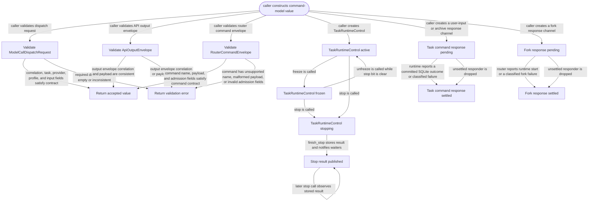

# command-model

<!-- selvedge-package-readme
package: selvedge-command-model
freshness_fingerprint: 21a340d3b3669a1e9281100baae8e824a6336567
-->

This crate defines the Selvedge command model API slice used to dispatch model calls, return completed API outputs to the router, and describe router-mediated client event ingress.

Use it to define model-call request correlation, dispatch request, output envelope, call error, router ingress message types, router commands, factory output messages, event ingress messages, client subscriptions, client snapshots, raw events, and client outbound frames.

This crate is not for network access, database access, filesystem access, provider execution, or task runtime mutation.

`RuntimeReady` is only a readiness signal. The task runtime sender is returned by `selvedge-core::spawn_task_runtime` to the creator that owns router registration.
`TaskRuntimeControl` is the shared control block for one runtime. Freeze is a state bit on that control block. `TaskRuntimeControl::stop` is an async function with synchronous barrier semantics: it sets the stop bit and resolves only after the runtime actor writes `TaskRuntimeStopResult`.
`TaskRuntimeCommand` carries business input only. Stop is outside the business mailbox.
`RouterCommand::SendUserInput` and `RouterCommand::ArchiveTask` carry typed responders through the router and task runtime. Input succeeds as `Committed` with its persisted history node id or as `Queued`; archive succeeds as `Archived`. Dropping an unsettled responder returns `RuntimeUnavailable`, so mailbox replacement, cancellation, and shutdown cannot be mistaken for a committed SQLite transition.
`RouterCommand::CreateChildTaskAndRuntime` carries the parent and exact function-call identity plus the typed child prompt. Its responder succeeds only after the fork transaction commits and the child runtime is registered and accepts `Start`. A later runtime failure preserves the durable child id in `RuntimeStartFailedAfterChildCreated`.
`RouterIngressSender` is unbounded. Runtime, API, and tool outputs must be able to enqueue router ingress without awaiting router mailbox capacity, because router stop waits synchronously for runtime actors to finish.
`RouterIngressWeakSender` is for internal router producers. Internal producers upgrade it only while an external ingress owner keeps the router mailbox open.
`CoreOutputEnvelope` carries `task_id` for task-based router routing.
Function-call history projections and tool execution requests carry their arguments as one `JsonObject`, so nested values, arrays, nulls, and exact JSON numbers cross router and client boundaries without flat primitive conversion.

`EventIngressSender` is owned by the router. `ClientFrameSender` is supplied by the router for a single client session. Delivery sequencing and hydration buffering live in `selvedge-events`.
`RouterCommand::AttachClient` carries an admission responder. The router must answer it after events reserves the client session slot; server uses that response as the attach accepted boundary before starting client-sync hydration.
`DetachReason::ClientRequested` represents an explicit detach command. `DetachReason::ClientDisconnected` represents the server observing the attach stream close.

Factory output envelopes are returned by synchronous factory calls. Runtime inventory is supplied to the factory by the router from router-owned live and pending task runtime state.

## Package State Machine

The diagram records the package-level observable states and transition paths. Each edge label names the concrete condition checked at this package boundary.

