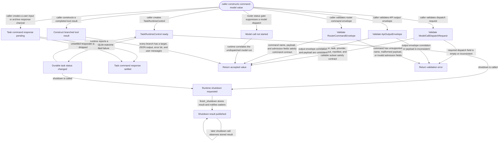

# command-model

<!-- selvedge-package-readme
package: selvedge-command-model
freshness_fingerprint: 1836384ffaf49eaa40b440ad0fd585805a2df7b9
-->

This crate defines the Selvedge command model API slice used to dispatch model calls, return completed API and branched tool outputs to the router, and describe router-mediated client event ingress.

Use it to define model-call request correlation, dispatch request, output envelope, call error, router ingress message types, router commands, factory output messages, event ingress messages, client subscriptions, client snapshots, raw events, and client outbound frames.

This crate is not for network access, database access, filesystem access, provider execution, or task runtime mutation.

`RuntimeReady` is only a readiness signal. The task runtime sender is returned by `selvedge-core::spawn_task_runtime` to the creator that owns router registration.
`TaskRuntimeControl` is the shared control block for one runtime. It notifies the actor after a durable status change and provides a synchronous actor-exit barrier. Process shutdown sets the shutdown request before waiting on that barrier; archive only notifies the actor and waits for the same barrier. The control block does not store task status.
`TaskRuntimeCommand` carries ordered actor work. `ModelCallNotStarted` is the typed result of a router dispatch gate rejecting a model request after the durable status stopped permitting model calls; it is distinct from a provider API failure. Lifecycle transitions remain outside the task mailbox so a frozen actor can still unfreeze or archive.
`RouterCommand::SendUserInput` and each lifecycle command carry typed responders. Input succeeds as `Committed` with its persisted history node id or as `Queued`; a lifecycle command succeeds with its committed `TaskStatus`. Dropping an unsettled responder returns `RuntimeUnavailable`, so mailbox replacement, cancellation, and shutdown cannot be mistaken for a committed SQLite transition.
`ToolExecutionResult` contains one or more ordered branches. A branch targets the calling task or a newly identified child task and carries JSON output, an error bit, and ordinary user messages to append after the output. `CoreOutputMessage::EnsureTaskRuntimes` asks the router to start runtimes for task ids that core has already committed.
`RouterIngressSender` is unbounded. Runtime, API, and tool outputs must be able to enqueue router ingress without awaiting router mailbox capacity, because archive and process shutdown can synchronously wait for runtime actors to finish.
`RouterIngressWeakSender` is for internal router producers. Internal producers upgrade it only while an external ingress owner keeps the router mailbox open.
`CoreOutputEnvelope` carries `task_id` for task-based router routing.
Function-call history projections and tool execution requests carry their arguments as one `JsonObject`; function-output projections carry one JSON value. Nested values, arrays, nulls, and exact JSON numbers therefore cross router and client boundaries without flat primitive or string conversion.
`ModelCallDispatchRequest` carries the complete frozen manifest and a provider-neutral `CallableTools` selection for the current turn. Validation requires every explicitly callable name to be unique and present in that manifest.

`EventIngressSender` is owned by the router. `ClientFrameSender` is supplied by the router for a single client session. Delivery sequencing and hydration buffering live in `selvedge-events`.
`RouterCommand::AttachClient` carries an admission responder. The router must answer it after events reserves the client session slot; server uses that response as the attach accepted boundary before starting client-sync hydration.
`DetachReason::ClientRequested` represents an explicit detach command. `DetachReason::ClientDisconnected` represents the server observing the attach stream close.

Factory output envelopes are returned by synchronous factory calls. Runtime inventory is supplied to the factory by the router from router-owned live and pending task runtime state.

## Package State Machine

The diagram records the package-level observable states and transition paths. Each edge label names the concrete condition checked at this package boundary.

