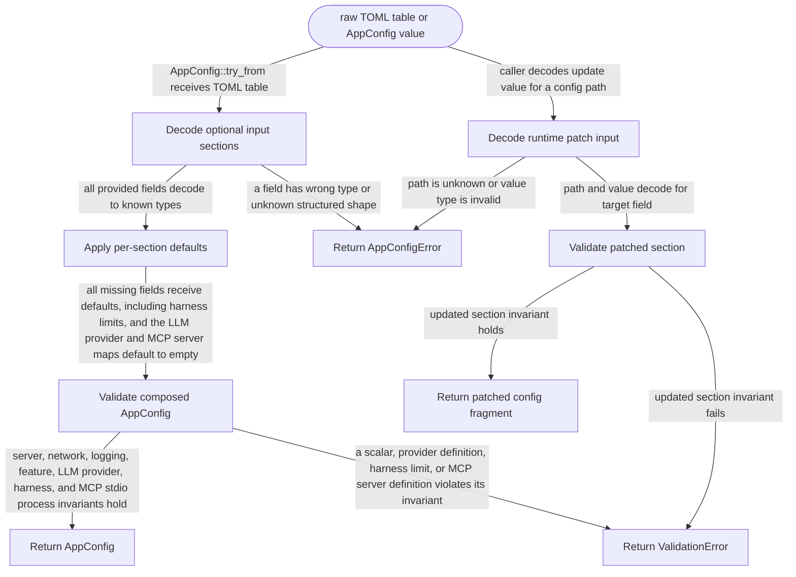

# config-model

<!-- selvedge-package-readme
package: selvedge-config-model
freshness_fingerprint: 20c082e89b2dbd7a48dbfd93630e583c0e60f77f
-->

## This crate is for

This crate defines the final application config model.

Use it to:

- define config structs
- define defaults next to those structs
- define validation rules next to those structs
- materialize `AppConfig` from raw TOML input
- expose strongly typed logging levels and module-level log overrides
- expose strongly typed network settings consumed by transport crates
- expose validated harness fan-out limits
- expose validated stdio MCP server process settings

## This crate is not for

This crate is not for:

- reading files
- searching config paths
- applying runtime patches
- persisting updates

Those responsibilities belong in the runtime config crate.

## Quick start

```no_run
use std::convert::TryFrom;

use selvedge_config_model::AppConfig;
use toml::Table;

fn main() -> Result<(), Box<dyn std::error::Error>> {
    let config = AppConfig::try_from(Table::new())?;
    config.validate()?;

    println!("default port = {}", config.server.port);

    Ok(())
}
```

## Add config for your module

When your module needs a new config field:

1. add the field to the module config struct
2. add the default value next to that struct
3. add the matching input/patch field
4. add module-local validation if needed

If the module is a new top-level config section, also plug it into `AppConfig`.

## Read config

Callers read strongly typed fields from `AppConfig`.

```no_run
# use std::convert::TryFrom;
# use selvedge_config_model::AppConfig;
# let config = AppConfig::try_from(toml::Table::new())?;
let timeout_ms = config.server.request_timeout_ms;
# let _ = timeout_ms;
# Ok::<(), Box<dyn std::error::Error>>(())
```

Network-facing modules read from `config.network`.

```no_run
# use std::convert::TryFrom;
# use selvedge_config_model::AppConfig;
# let config = AppConfig::try_from(toml::Table::new())?;
let connect_timeout = config.network.connect_timeout_ms;
# let _ = connect_timeout;
# Ok::<(), Box<dyn std::error::Error>>(())
```

`NetworkConfig` intentionally keeps transport-facing settings optional.

- unset `network.*` fields stay `None` in `AppConfig`
- `config-model` does not inject fallback transport defaults for those fields
- downstream transport crates decide whether `None` means "do not set this option" or "treat this as an error"
- this is different from fields such as `server.request_timeout_ms`, which materialize to a concrete default value inside the config model

Configured MCP clients read complete stdio process definitions from
`config.mcp.servers`. Missing `[mcp]` configuration produces an empty map, and
each configured server defaults to a 60-second call timeout.

Harness limits read from `[harness]`. `max_children_per_fork` defaults to `5`,
`max_descendants_per_task` defaults to `20`, and the per-call limit cannot
exceed the per-task descendant limit.

## Validation

Each config type validates its own invariants.

`AppConfig::validate()` only composes child validation and top-level
cross-field rules.

## Logging config

`LoggingConfig` keeps logging strongly typed:

- `level` is a `LogFilter`
- `module_levels` stores per-module-path minimum levels

Example:

```no_run
# use std::convert::TryFrom;
# use std::collections::BTreeMap;
# use selvedge_config_model::{AppConfig, LogFilter};
let config = AppConfig::try_from(toml::toml! {
    [logging]
    level = "warn"

    [logging.module_levels]
    "selvedge::router" = "debug"
})?;

assert_eq!(config.logging.level, LogFilter::Warn);
assert_eq!(
    config.logging.module_levels,
    BTreeMap::from([("selvedge::router".to_owned(), LogFilter::Debug)])
);
# Ok::<(), Box<dyn std::error::Error>>(())
```

Callers that need module-path matching should perform that matching outside the
model layer.

## Package State Machine

The diagram records the package-level observable states and transition paths. Each edge label names the concrete condition checked at this package boundary.


