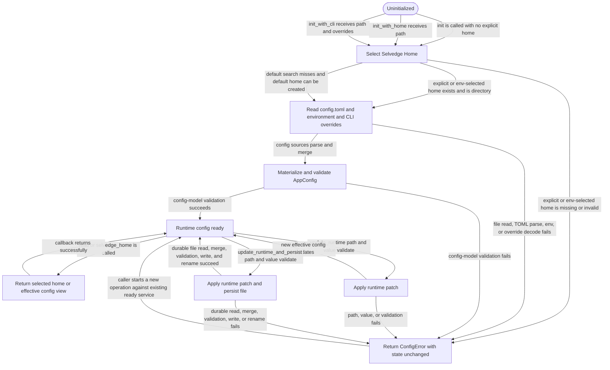

# config

<!-- selvedge-package-readme
package: selvedge-config
freshness_fingerprint: 01185b6bb674ca85e8d2c54311fbdb16223218af
-->

## This crate is for

This crate is the project-specific runtime config entrypoint.

Use it to:

- initialize the current project's config service
- read the selected Selvedge Home directory
- read the current effective config view
- apply runtime-only updates
- apply runtime updates and persist them back to the selected Selvedge Home

## This crate is not for

This crate is not for:

- defining config schema
- defining defaults
- defining validation rules
- exposing file search policy, environment prefixes, or patch internals to
  callers

Those responsibilities belong in `config-model` or stay private inside this
crate.

## Scope and model

This crate works in two steps:

1. select a Selvedge Home directory
2. read or write `config.toml` inside that directory

Selvedge Home selection and `config.toml` access are separate concerns.

- Selvedge Home selection chooses a directory path.
- The config file path is always `<selvedge-home>/config.toml`.
- Runtime reads use the current effective config view.
- Persisted writes always target the currently selected Selvedge Home.

## Quick start

```no_run
use selvedge_config::{init, read, update_runtime_and_persist};

fn main() -> Result<(), Box<dyn std::error::Error>> {
    init()?;
    let port = read(|config| config.server.port)?;

    println!("listening on {port}");

    update_runtime_and_persist("logging.level", "debug")?;

    Ok(())
}
```

## Add config for your module

When your module needs a new config field:

1. Change `config-model`.
2. Do not change this crate's load/update internals.
3. Read or update the new field through the existing public methods here.

This crate should stay unchanged when a module only adds new config fields.

## Select Selvedge Home

Use one of these entrypoints:

- `init()`
- `init_with_home(path)`
- `init_with_cli(path, overrides)`

Selection semantics:

- `init_with_home(path)` treats `path` as a Selvedge Home directory.
- `SELVEDGE_HOME` also points to a Selvedge Home directory.
- `init()` searches Selvedge Home directories in a fixed internal order.
- If search does not select a home, `init()` creates a default Selvedge Home and
  an empty `config.toml`.

The search step selects a directory. The config file is always
`<selected-home>/config.toml`.

## Read config

Use `read(...)`.

Semantics:

- callers see the current effective config
- effective config = loaded base config + runtime-only patch
- callers never touch internal merge state or path selection state

```no_run
# use selvedge_config::{init, read};
# init()?;
let timeout_ms = read(|config| config.server.request_timeout_ms)?;
# Ok::<(), Box<dyn std::error::Error>>(())
```

Use `selvedge_home()` when a caller needs the selected Selvedge Home directory.

```no_run
# use selvedge_config::{init, selvedge_home};
# init()?;
let home = selvedge_home()?;
assert!(home.ends_with("selvedge") || home.ends_with(".selvedge"));
# Ok::<(), Box<dyn std::error::Error>>(())
```

## Update runtime config

Use `update_runtime(path, value)`.

Semantics:

- changes are visible to later `read()` calls immediately
- changes are not written to disk
- failure leaves visible runtime state unchanged

```no_run
# use selvedge_config::{init, update_runtime};
# init()?;
update_runtime("feature.rollout_percentage", 100_u8)?;
update_runtime("feature.enabled", true)?;
# Ok::<(), Box<dyn std::error::Error>>(())
```

## Update runtime and persist

Use `update_runtime_and_persist(path, value)`.

Semantics:

- the update changes the current runtime view
- the same update is validated before writing
- runtime-only updates are not implicitly persisted
- the persisted file path is always `<selected-home>/config.toml`
- if `config.toml` does not exist yet, this crate creates that file in the
  selected Selvedge Home
- persisted output starts from the current durable file contents, or an empty
  file when no durable file exists
- only explicitly persisted updates are written to disk

```no_run
# use selvedge_config::{init, update_runtime_and_persist};
# init()?;
update_runtime_and_persist("logging.level", "debug")?;
# Ok::<(), Box<dyn std::error::Error>>(())
```

## Errors and guarantees

- `init()` searches Selvedge Home directories in a fixed internal order.
- `init_with_home(path)` bypasses search and uses only that Selvedge Home.
- `SELVEDGE_HOME` overrides default search and must point to a real Selvedge
  Home directory.
- `init_with_cli(path, overrides)` applies CLI overrides on top of file/env.
- invalid explicit or env-selected homes fail fast
- if no default home is found, `init()` creates a default Selvedge Home and an
  empty `config.toml`
- failed updates do not commit runtime state
- failed persisted updates do not commit runtime state or file state

Failure semantics:

- explicit or env-selected homes must exist and be directories
- invalid file contents fail during load
- invalid merged config fails during initialization
- invalid update paths or values fail before runtime state changes
- failed persisted writes leave runtime state and file state unchanged

Runnable examples live in `crates/config/examples/`.

## Package State Machine

The diagram records the package-level observable states and transition paths. Each edge label names the concrete condition checked at this package boundary.


