# core

<!-- selvedge-package-readme
package: selvedge-core
freshness_fingerprint: d38e12a930e3fa08fd19a0102baa74dd96c15c77
-->

This crate runs one task runtime actor per active task.

Use it to spawn a task-local runtime that loads SQLite state through `selvedge-db`, queues input while busy, requests model calls through the router, requests tool execution through the router, and exits on archive or database errors.

This crate only talks to the router mailbox and the database package. Provider calls, tool execution, event fanout, runtime registry ownership, and direct client delivery live in other crates.

On `Start`, the runtime first reconciles every open function call on the current cursor path using its task-frozen recovery policy. Retry-safe calls resume execution. Calls whose outcomes may be unknown receive a durable ordinary error output without invoking the executor, after which the model decides whether state inspection or another call is needed. With no open call, user/system/function-output tails request a model call and assistant/developer tails await user input with an empty queue. The runtime keeps only in-flight correlation ids, the complete manifest and callable subset sent with an active model request, and pending tool-call identity in memory; the task cursor lives in SQLite.

Before dispatching a model call, the actor reads the conversation, frozen tool manifest, unavailable-tool exceptions, and active model profile together on Tokio's blocking thread pool. The complete manifest remains stable while the exceptions produce the callable subset for that turn. SQLite work therefore leaves async runtime workers available for other actors.

Durable history is projected into one provider-neutral conversation model whose message content is JSON. Function calls and outputs use the shared discriminated JSON contract from `selvedge-domain-model`; core validates call/output pairing through that contract without introducing a second conversation representation.

A matching tool execution result contains one or more history branches. Core commits all branch outputs, child tasks, optional child messages, and cursor changes through one database transaction. The calling task always has exactly one branch; any committed child task ids are then sent to the router's ordinary runtime-ensure path. If that transaction rejects a fork because an ancestor reached its configured descendant limit, core commits one ordinary error output for the same call and continues the model loop. Runtime creation is derived from committed task state and is not part of the history transaction.

When a matching model reply arrives, the actor validates it against the exact manifest and callable subset stored for that model run rather than reading current availability again. A tool marked unavailable after request dispatch can therefore finish the already-issued turn. Core rejects duplicate call ids, tools absent from the frozen manifest, and tools excluded from that turn, but leaves JSON Schema interpretation to the selected executor.

The actor checks `TaskRuntimeControl` before receiving each business mailbox command. A stop request makes the actor return from its loop at that safety point. The mailbox receive branch is behind the control branch and the actor rechecks stop after receiving a command, so a stop bit observed at the event boundary prevents the next business command from starting. The runtime writes `TaskRuntimeStopResult` from the actor's unified exit path, so a later stop call also completes after archive, database error, router shutdown, or dropped runtime mailbox.

User-input responders return `Committed` with the persisted history node id only after the history append and cursor transaction commits, or `Queued` only after the FIFO queue transaction commits. Archive returns `Archived` only after its transaction commits. On archive, database failure, internal failure, or stop, the runtime drains its business mailbox and settles every remaining task responder with the terminal task error.

Runtime output to the router uses the unbounded router ingress sender. Event handlers can enqueue router output synchronously and return to the control check without waiting for router mailbox capacity.

`TaskRuntimeSpawnDeps` wraps the runtime config and a `TaskRuntimeSpawner` implementation. Use `TaskRuntimeSpawnDeps::new` for the default Tokio-backed spawner and `with_spawner` for boundary tests.

## Package State Machine

The diagram records the package-level observable states and transition paths. Each edge label names the concrete condition checked at this package boundary.

```mermaid
flowchart TD
  Start([spawn_task_runtime])
  LoadSnapshot[Read active task snapshot]
  RecoverOpen{open function calls}
  CommitUnknown[Commit unknown-outcome error outputs]
  ClassifyTail{cursor tail}
  AwaitInput[Await user input]
  RequestModel[Load model context on blocking pool and send request]
  AwaitModel[Await matching API output]
  ValidateModelReply[Validate reply against sent manifest and callable snapshots]
  RequestTool[Send tool execution request to router]
  AwaitTool[Await matching tool output]
  CommitToolBranches[Atomically commit tool-result branches]
  CommitLimitOutput[Commit one calling-task limit error output]
  EnsureChildRuntimes[Ask router to ensure committed child runtimes]
  QueueInput[Queue or append user input]
  InputSettled[Settle input responder]
  Archive[Archive task]
  ArchiveSettled[Settle archive responder]
  FailPending[Fail remaining task responders]
  Stop[Exit after stop control]
  Exit[Publish TaskRuntimeExitNotice]
  DbError[Exit on database error]
  RouterClosed[Exit on router ingress closure]
  InternalError[Exit on invalid correlated reply]

  Start -->|task runtime actor starts| LoadSnapshot
  LoadSnapshot -->|active task snapshot read succeeds| RecoverOpen
  LoadSnapshot -->|database read fails or task is inactive| DbError
  RecoverOpen -->|none remain| ClassifyTail
  RecoverOpen -->|only retry-safe calls remain| RequestTool
  RecoverOpen -->|any outcome may be unknown| CommitUnknown
  CommitUnknown -->|retry-safe calls remain| RequestTool
  CommitUnknown -->|all calls are settled| RequestModel
  CommitUnknown -->|database transition fails| DbError
  ClassifyTail -->|tail is user, system, or function output| RequestModel
  ClassifyTail -->|tail is function call| RequestTool
  ClassifyTail -->|tail is assistant or developer and queued input is empty| AwaitInput
  ClassifyTail -->|tail is assistant or developer and queued input exists| QueueInput
  RequestModel -->|database reads and router ingress send succeed| AwaitModel
  RequestModel -->|database read fails| DbError
  RequestModel -->|router ingress send fails| RouterClosed
  AwaitModel -->|matching completed API output arrives| ValidateModelReply
  ValidateModelReply -->|call ids are unique and every tool belongs to both sent snapshots| ClassifyTail
  ValidateModelReply -->|a call id is duplicated or a tool was absent or unavailable for that turn| InternalError
  AwaitModel -->|matching failed API output arrives| AwaitInput
  AwaitModel -->|user input arrives while model is in flight| QueueInput
  RequestTool -->|router ingress send succeeds| AwaitTool
  RequestTool -->|router ingress send fails| RouterClosed
  AwaitTool -->|matching tool result arrives| CommitToolBranches
  CommitToolBranches -->|single calling branch commits| ClassifyTail
  CommitToolBranches -->|calling and child branches commit| EnsureChildRuntimes
  CommitToolBranches -->|an ancestor would exceed its descendant limit| CommitLimitOutput
  CommitLimitOutput -->|error output commits| ClassifyTail
  CommitLimitOutput -->|database transition fails| DbError
  CommitToolBranches -->|database transition fails| DbError
  EnsureChildRuntimes -->|router ingress send succeeds| ClassifyTail
  EnsureChildRuntimes -->|router ingress send fails| RouterClosed
  AwaitTool -->|user input arrives while tool is in flight| QueueInput
  AwaitInput -->|user input command arrives| QueueInput
  QueueInput -->|database transition succeeds| InputSettled
  InputSettled -->|committed or queued outcome is sent| ClassifyTail
  QueueInput -->|database transition fails and responder is failed| DbError
  AwaitInput -->|archive command arrives| Archive
  Archive -->|database archive succeeds| ArchiveSettled
  ArchiveSettled -->|archived outcome is sent| FailPending
  Archive -->|database archive fails and responder is failed| DbError
  AwaitInput -->|stop control observed before business command starts| Stop
  AwaitModel -->|stop control observed at command boundary| Stop
  AwaitTool -->|stop control observed at command boundary| Stop
  Stop -->|runtime unavailable is selected| FailPending
  DbError -->|database error is classified| FailPending
  RouterClosed -->|runtime unavailable is selected| FailPending
  InternalError -->|runtime unavailable is selected| FailPending
  FailPending -->|mailbox responders are settled exactly once| Exit
```

