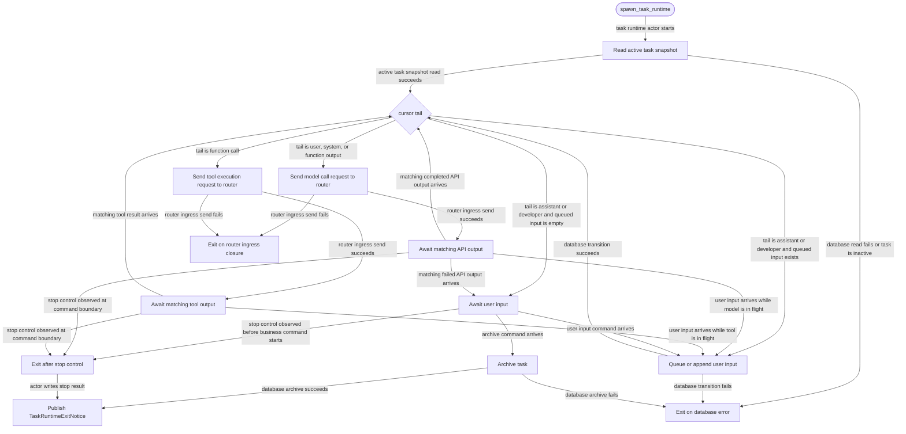

# core

<!-- selvedge-package-readme
package: selvedge-core
freshness_commit: 592f95539c225023a2f2d66f8096a3f85ac304ee
-->

This crate runs one task runtime actor per active task.

Use it to spawn a task-local runtime that loads SQLite state through `selvedge-db`, queues input while busy, requests model calls through the router, requests tool execution through the router, and exits on archive or database errors.

This crate only talks to the router mailbox and the database package. Provider calls, tool execution, event fanout, runtime registry ownership, and direct client delivery live in other crates.

On `Start`, the runtime reads the active task snapshot and classifies the concrete cursor tail. User/system/function-output tails request a model call; function-call tails request tool execution; assistant/developer tails await user input with an empty queue. The runtime keeps only in-flight correlation ids and pending tool-call identity in memory; the task cursor lives in SQLite.

The actor checks `TaskRuntimeControl` before receiving each business mailbox command. A stop request makes the actor return from its loop at that safety point. The mailbox receive branch is behind the control branch and the actor rechecks stop after receiving a command, so a stop bit observed at the event boundary prevents the next business command from starting. The runtime writes `TaskRuntimeStopResult` from the actor's unified exit path, so a later stop call also completes after archive, database error, router shutdown, or dropped runtime mailbox.

Runtime output to the router uses the unbounded router ingress sender. Event handlers can enqueue router output synchronously and return to the control check without waiting for router mailbox capacity.

`TaskRuntimeSpawnDeps` wraps the runtime config and a `TaskRuntimeSpawner` implementation. Use `TaskRuntimeSpawnDeps::new` for the default Tokio-backed spawner and `with_spawner` for boundary tests.

## Package State Machine

The diagram records the package-level observable states and transition paths. Each edge label names the concrete condition checked at this package boundary.

