# core

<!-- selvedge-package-readme
package: selvedge-core
freshness_fingerprint: 3369d0f918c2e19040784c484ed51c1c6a90fc08
-->

This crate runs one task runtime actor per non-archived task.

Use it to spawn a task-local runtime that loads SQLite state through `selvedge-db`, queues input while busy, requests model calls through the router, requests tool execution through the router, and exits on archive or database errors.

This crate only talks to the router mailbox and the database package. Provider calls, tool execution, event fanout, runtime registry ownership, and direct client delivery live in other crates.

On `Start`, the runtime reads the persisted task status. An `active` task starts normal cursor processing. A `stopped` task still reconciles open tool calls and commits their results, but it does not request another model call. A `frozen` task publishes readiness and does not consume its mailbox until a status notification confirms that it is active. The runtime keeps only in-flight correlation ids, the complete manifest and callable subset sent with an active model request, pending tool-call identity, and a deferred model-call continuation in memory; the task status and cursor live in SQLite.

Before dispatching a model call, the actor reads the conversation, frozen tool manifest, unavailable-tool exceptions, and active model profile together on Tokio's blocking thread pool. The complete manifest remains stable while the exceptions produce the callable subset for that turn. SQLite work therefore leaves async runtime workers available for other actors.

Durable history is projected into one provider-neutral conversation model whose message content is JSON. Function calls and outputs use the shared discriminated JSON contract from `selvedge-domain-model`; core validates call/output pairing through that contract without introducing a second conversation representation.

A matching tool execution result contains one or more history branches. Core commits all branch outputs, child tasks, optional child messages, and cursor changes through one database transaction. The calling task always has exactly one branch; any committed child task ids are then sent to the router's ordinary runtime-ensure path. If that transaction rejects a fork because an ancestor reached its configured descendant limit, core commits one ordinary error output for the same call and continues the model loop. Runtime creation is derived from committed task state and is not part of the history transaction.

When a matching model reply arrives, the actor validates it against the exact manifest and callable subset stored for that model run rather than reading current availability again. A tool marked unavailable after request dispatch can therefore finish the already-issued turn. Core rejects duplicate call ids, tools absent from the frozen manifest, and tools excluded from that turn, but leaves JSON Schema interpretation to the selected executor.

The router can return `ModelCallNotStarted` when task status changes after core's final active check but before API dispatch. Core correlates that result separately from provider failure, reloads durable status, and either retries the continuation when active, defers it while frozen, or waits for new user input while stopped. Before a stopped actor waits, it promotes existing queued inputs to the cursor without calling the model, so a later activating input cannot overtake the durable FIFO.

`TaskRuntimeControl` carries only high-priority notifications and the process shutdown barrier. A status notification makes the actor read the database again. `frozen` pauses mailbox consumption, `archived` exits the actor, and `active` or `stopped` resumes mailbox processing. A shutdown request prevents the next mailbox command from starting and completes only after the actor's unified exit path runs.

User-input responders return `Committed` with the persisted history node id only after the history append and cursor transaction commits, or `Queued` only after the FIFO queue transaction commits. A user input received while stopped activates the task in the same database transaction. On archive, database failure, internal failure, or shutdown, the runtime drains its mailbox and settles every remaining task responder with the terminal task error.

Runtime output to the router uses the unbounded router ingress sender. Event handlers can enqueue router output synchronously and return to the control check without waiting for router mailbox capacity.

`TaskRuntimeSpawnDeps` wraps the runtime config and a `TaskRuntimeSpawner` implementation. Use `TaskRuntimeSpawnDeps::new` for the default Tokio-backed spawner and `with_spawner` for boundary tests.

## Package State Machine

The diagram records the package-level observable states and transition paths. Each edge label names the concrete condition checked at this package boundary.

```mermaid
flowchart TD
  Start([spawn_task_runtime])
  LoadSnapshot[Read non-archived task snapshot]
  Status{persisted task status}
  Frozen[Pause mailbox consumption]
  ReloadStatus[Read status after control notification]
  ResumeWork[Resume saved runtime state]
  RecoverOpen{open function calls}
  CommitUnknown[Commit unknown-outcome error outputs]
  ClassifyTail{cursor tail}
  AwaitInput[Await user input]
  RequestModel[Load model context on blocking pool and send request]
  AwaitModel[Await matching API output]
  ModelNotStarted[Correlate model call not started]
  PromoteStoppedQueue[Promote durable input queue without model call]
  ValidateModelReply[Validate reply against sent manifest and callable snapshots]
  RequestTool[Send tool execution request to router]
  AwaitTool[Await matching tool output]
  CommitToolBranches[Atomically commit tool-result branches]
  CommitLimitOutput[Commit one calling-task limit error output]
  EnsureChildRuntimes[Ask router to ensure committed child runtimes]
  QueueInput[Queue or append user input]
  InputSettled[Settle input responder]
  FailPending[Fail remaining task responders]
  Shutdown[Exit after shutdown control]
  Archived[Exit after archived status notification]
  Exit[Publish TaskRuntimeExitNotice]
  DbError[Exit on database error]
  RouterClosed[Exit on router ingress closure]
  InternalError[Exit on invalid correlated reply]

  Start -->|task runtime actor starts| LoadSnapshot
  LoadSnapshot -->|runtime task snapshot read succeeds| Status
  LoadSnapshot -->|database read fails or task is archived| DbError
  Status -->|status is frozen| Frozen
  Status -->|status is active or stopped| RecoverOpen
  Frozen -->|status control is notified| ReloadStatus
  ReloadStatus -->|status is still frozen| Frozen
  ReloadStatus -->|status is active| ResumeWork
  ReloadStatus -->|status is archived| Archived
  ResumeWork -->|cursor processing has not started| RecoverOpen
  ResumeWork -->|a model call was deferred by freeze| RequestModel
  ResumeWork -->|an API result is pending| AwaitModel
  ResumeWork -->|a tool result is pending| AwaitTool
  ResumeWork -->|user input is pending| AwaitInput
  RecoverOpen -->|none remain| ClassifyTail
  RecoverOpen -->|only retry-safe calls remain| RequestTool
  RecoverOpen -->|any outcome may be unknown| CommitUnknown
  CommitUnknown -->|retry-safe calls remain| RequestTool
  CommitUnknown -->|all calls are settled| RequestModel
  CommitUnknown -->|database transition fails| DbError
  ClassifyTail -->|tail is user, system, or function output| RequestModel
  ClassifyTail -->|tail is function call| RequestTool
  ClassifyTail -->|tail is assistant or developer and queued input is empty| AwaitInput
  ClassifyTail -->|tail is assistant or developer and queued input exists| QueueInput
  RequestModel -->|status is stopped| PromoteStoppedQueue
  RequestModel -->|status is frozen| Frozen
  RequestModel -->|status is active and database reads and router ingress send succeed| AwaitModel
  RequestModel -->|database read fails| DbError
  RequestModel -->|router ingress send fails| RouterClosed
  AwaitModel -->|matching completed API output arrives| ValidateModelReply
  AwaitModel -->|router rejects dispatch after status changes| ModelNotStarted
  ModelNotStarted -->|status is active| RequestModel
  ModelNotStarted -->|status is frozen| Frozen
  ModelNotStarted -->|status is stopped| PromoteStoppedQueue
  ModelNotStarted -->|status is archived| Archived
  PromoteStoppedQueue -->|FIFO is empty after promotion| AwaitInput
  ValidateModelReply -->|call ids are unique and every tool belongs to both sent snapshots| ClassifyTail
  ValidateModelReply -->|a call id is duplicated or a tool was absent or unavailable for that turn| InternalError
  AwaitModel -->|matching failed API output arrives| AwaitInput
  AwaitModel -->|user input arrives while model is in flight| QueueInput
  RequestTool -->|router ingress send succeeds| AwaitTool
  RequestTool -->|router ingress send fails| RouterClosed
  AwaitTool -->|matching tool result arrives| CommitToolBranches
  CommitToolBranches -->|single calling branch commits| ClassifyTail
  CommitToolBranches -->|calling and child branches commit| EnsureChildRuntimes
  CommitToolBranches -->|an ancestor would exceed its descendant limit| CommitLimitOutput
  CommitLimitOutput -->|error output commits| ClassifyTail
  CommitLimitOutput -->|database transition fails| DbError
  CommitToolBranches -->|database transition fails| DbError
  EnsureChildRuntimes -->|router ingress send succeeds| ClassifyTail
  EnsureChildRuntimes -->|router ingress send fails| RouterClosed
  AwaitTool -->|user input arrives while tool is in flight| QueueInput
  AwaitInput -->|user input command arrives| QueueInput
  QueueInput -->|database transition succeeds| InputSettled
  InputSettled -->|committed or queued outcome is sent| ClassifyTail
  QueueInput -->|database transition fails and responder is failed| DbError
  AwaitInput -->|archived status notification arrives| Archived
  AwaitModel -->|archived status notification arrives| Archived
  AwaitTool -->|archived status notification arrives| Archived
  AwaitInput -->|shutdown control is observed| Shutdown
  AwaitModel -->|shutdown control is observed| Shutdown
  AwaitTool -->|shutdown control is observed| Shutdown
  Shutdown -->|runtime unavailable is selected| FailPending
  Archived -->|task archived is selected| FailPending
  DbError -->|database error is classified| FailPending
  RouterClosed -->|runtime unavailable is selected| FailPending
  InternalError -->|runtime unavailable is selected| FailPending
  FailPending -->|mailbox responders are settled exactly once| Exit
```

