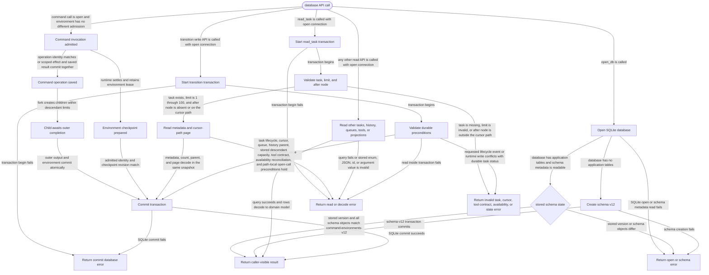

# db

<!-- selvedge-package-readme
package: selvedge-db
freshness_fingerprint: 936d7d10bfa150a5fc763d422a2363797919fa27
-->

This crate owns SQLite persistence for router-mediated Selvedge tasks.

Use it to create and open schema-v12 SQLite databases, create tasks with frozen tool contracts, reconcile task-local tool availability, atomically commit tool-result branches, persist task lifecycle transitions, queue user inputs, and read bounded task snapshots. Nonempty databases must match schema v12 exactly.

This crate is for SQLite persistence only. Runtime wait state, provider calls, tool execution, router registries, and event delivery live in other crates.

Resource boundaries:

- `create_history_node` inserts one history node. History parent links are a standalone graph.
- `create_root_task` inserts one task row at a caller-provided existing `cursor_node_id`. Task parent links and history parent links are separate graphs.
- `create_root_task` stores one ordered `TaskToolSpec` set, including each tool's recovery policy, and the current fork and descendant limits with the new task. These values are immutable task contract data rather than references to a mutable catalog.
- `reconcile_task_tool_availability` compares stored task routes with the current runtime catalog and replaces only each task's unavailable-tool set. An empty set permits the complete frozen manifest; duplicate runtime names reject the transaction.
- `read_task_tool_state` returns the complete frozen manifest and its unavailable exceptions. `read_tool_manifest_for_task` therefore remains stable when runtime tools disappear.
- `commit_tool_result_branches` requires one calling-task branch and accepts zero or more new-child branches for an exact open function call on the calling task's current cursor path. Before writing, the same immediate transaction verifies that adding those children keeps the calling task and every ancestor within that ancestor's stored descendant limit; archived descendants still count. Every output is a sibling under that cursor. The calling branch then appends its supplied user messages and drains queued inputs; each child branch appends its own supplied user messages. Child task rows, parent edges, inherited tool contracts, recovery policies and unavailable exceptions, all history nodes, and every cursor are committed in one transaction.
- `read_open_function_calls_for_task` returns every call without an output on the current cursor path together with the recovery policy frozen for that task.
- `transition_task_status` applies the strict `active`, `frozen`, `stopped`, and `archived` lifecycle. Archived tasks reject runtime writes. A user input atomically reactivates a stopped task as part of the input commit.
- `list_runtime_tasks` and `load_runtime_task` select every non-archived task. Runtime loading reads task data, cursor content, and the queued-input count in one transaction without loading tool definitions or queue contents. Queued inputs remain attached when a task is archived.
- Function outputs store arbitrary JSON values. The schema permits outputs for the same call on sibling paths while rejecting a second output on one history path.
- `read_task_metadata` reads only the task row, including its immutable shared `TaskModelConfig`.
- `append_assistant_message_and_drain_queue` reports whether its transaction promoted queued inputs so callers decide whether to continue the model loop from the committed outcome.
- `read_task` returns task identity, durable status, state version, cursor, optional parent, queued-input count, an exclusive `after_node_id` history page, and an exact `has_more` flag from one SQLite read transaction. Page limits are `1..=100`, and the after node must be on that task's cursor path.
- `read_task_parent_edges` returns durable task-layer parent edges for router snapshots and factory verification.
- `read_conversation_for_task` projects the cursor path into `Conversation.messages`: ordinary messages contain JSON strings, calls and outputs contain the shared JSON tool protocol, and every projected message records its source history node.
- A task cursor is a pointer into history, with no ownership claim over the pointed node.

Public transition writes keep cursor movement atomic with the history append they perform: user message commit, model reply with tool calls, assistant reply with queued-input drain, tool-result branch commit, queued input promotion, queue input, and archive.

## Command environments and durable operations

Tasks reference independently owned command environments. Root environments begin with an empty checkpoint; the harness installs base capabilities when restoring that placeholder. Ordinary child branches share their caller environment. Prepared command completion atomically commits the checkpoint revision, outer outputs, child environment choices, queued messages, and deferred self lifecycle changes. Copy forks receive the completed checkpoint; new forks receive the base checkpoint.

An admission belongs to the durable pair of task ID and function-call node ID. A different invocation receives `CommandEnvironmentBusy` with its predecessor identity. `list_admitted_command_invocations` enumerates admissions independently of task lifecycle, so startup can recover frozen, stopped, or archived owners before their pending children can run. Only an already admitted call may finish after its caller has been archived. Pending children are readable and accept scoped messages, but runtime listing and loading exclude them until their outer call commits. Failure before that transaction retains the admission and pending children for recovery.

Every operation journal entry validates its command name and structural JSON arguments before reusing its saved result. Scoped mutation APIs check self or direct-child permission and save the mutation and result in one transaction. Caller-only contexts preserve ordinary tools; clients retain the existing unscoped APIs. Startup execution permits task commands but rejects new external shell or filesystem effects. External operations persist admission before execution and completion separately; an unfinished admission has an unknown outcome and cannot be executed again. Reads and module-source observations reuse saved results. The replay length is the largest recorded ordinal plus one, including gaps.

Self lifecycle commands return `deferred: true` and store the resulting status with the task state version at first deferral. Each subsequent command validates its transition against that staged status. At completion, the validated result applies only if the caller state version still matches; a later committed task change supersedes it, including changes that return to the original status. A journaled mutation by the same invocation advances an uncontested baseline together with its effect; it never advances a baseline already superseded by another committed change. The outer output, checkpoint, and pending children still finalize when the deferred result is superseded. Task reads report committed status until completion. `validate_command_task_scope` provides a read-only permission check before runtime activation; mutation APIs repeat the permission check inside their write transaction.

## Package State Machine

The diagram records the package-level observable states and transition paths. Each edge label names the concrete condition checked at this package boundary.

