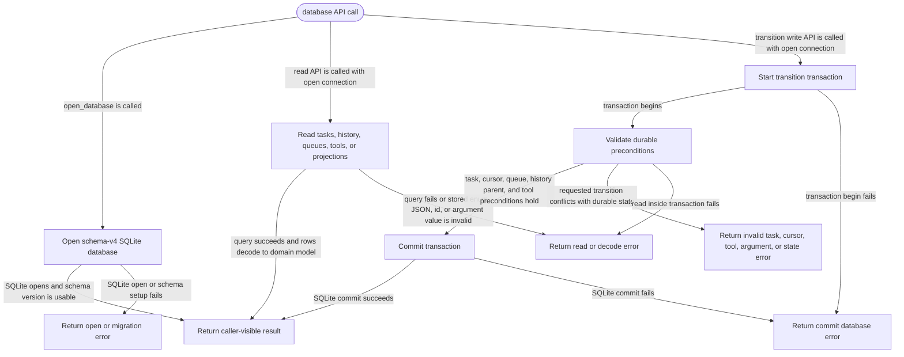

# db

<!-- selvedge-package-readme
package: selvedge-db
freshness_commit: 592f95539c225023a2f2d66f8096a3f85ac304ee
-->

This crate owns SQLite persistence for router-mediated Selvedge tasks.

Use it to open a schema-v4 SQLite database, register global tools, create tasks, commit task-runtime state transitions, queue user inputs, archive tasks, and read task-local model context.

This crate is for SQLite persistence only. Runtime wait state, provider calls, tool execution, router registries, and event delivery live in other crates.

Resource boundaries:

- `create_history_node` inserts one history node. History parent links are a standalone graph.
- `create_root_task` inserts one task row at a caller-provided existing `cursor_node_id`. Task parent links and history parent links are separate graphs.
- `create_child_task` records a task-layer parent edge and a caller-provided existing `cursor_node_id`.
- `read_task_parent_edges` returns durable task-layer parent edges for router snapshots and factory verification.
- A task cursor is a pointer into history, with no ownership claim over the pointed node.

Public transition writes keep cursor movement atomic with the history append they perform: user message commit, model reply with tool calls, assistant reply with queued-input drain, tool output with queued-input drain, queued input promotion, queue input, and archive.

## Package State Machine

The diagram records the package-level observable states and transition paths. Each edge label names the concrete condition checked at this package boundary.

