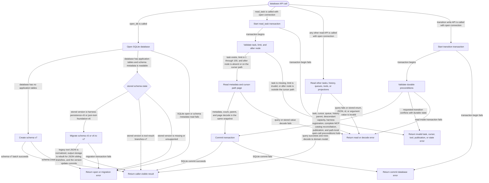

# db

<!-- selvedge-package-readme
package: selvedge-db
freshness_fingerprint: 03df8c8894b8981c2b0e2073c3bc917b08064d43
-->

This crate owns SQLite persistence for router-mediated Selvedge tasks.

Use it to open a schema-v7 SQLite database, migrate schema-v5 or schema-v6 databases, register harness tools, atomically reconcile the global MCP tool catalog, create root tasks, atomically commit tool-result branches, commit other task-runtime state transitions, queue user inputs, archive tasks, and read bounded task snapshots.

This crate is for SQLite persistence only. Runtime wait state, provider calls, tool execution, router registries, and event delivery live in other crates.

Resource boundaries:

- `create_history_node` inserts one history node. History parent links are a standalone graph.
- `create_root_task` inserts one task row at a caller-provided existing `cursor_node_id`. Task parent links and history parent links are separate graphs.
- Tool definitions store the complete input JSON Schema separately from a closed execution route. The current registration APIs create harness routes; a route can also represent one remote tool on a named MCP server.
- `register_global_tool` accepts a new harness definition, an exact harness repeat, or an exact non-global harness definition promoted to global. A conflicting schema, description, or route fails without changing the catalog.
- `replace_global_mcp_tools` treats its input as the complete discovered MCP catalog. One immediate transaction unpublishes every prior MCP route, inserts new routes, refreshes definitions for matching routes, and republishes the supplied set; duplicate local names, empty remote identities, and route conflicts roll back the whole refresh without changing harness rows.
- `unpublish_global_tool` changes only publication. The definition, execution route, task-specific references, and function-call history remain durable.
- `read_tool_manifest_for_task` merges database-marked global tools with that task's `task_tools` rows for active or archived tasks.
- `commit_tool_result_branches` requires one calling-task branch and accepts zero or more new-child branches for an exact open function call on the calling task's current cursor path. Before writing, the same immediate transaction verifies that adding those children keeps the calling task and every ancestor within `OpenDbOptions::max_task_descendants`; archived descendants still count. Every output is a sibling under that cursor. The calling branch then appends its supplied user messages and drains queued inputs; each child branch appends its own supplied user messages. Child task rows, parent edges, inherited task-specific tools, all history nodes, and every cursor are committed in one transaction.
- Function outputs store arbitrary JSON values. The schema permits outputs for the same call on sibling paths while rejecting a second output on one history path.
- `read_task` returns task identity, durable status, state version, cursor, optional parent, queued-input count, an exclusive `after_node_id` history page, and an exact `has_more` flag from one SQLite read transaction. Page limits are `1..=100`, and the after node must be on that task's cursor path.
- `read_task_parent_edges` returns durable task-layer parent edges for router snapshots and factory verification.
- `read_conversation_for_task` projects the cursor path into `Conversation.messages`: ordinary messages contain JSON strings, calls and outputs contain the shared JSON tool protocol, and every projected message records its source history node.
- A task cursor is a pointer into history, with no ownership claim over the pointed node.

Public transition writes keep cursor movement atomic with the history append they perform: user message commit, model reply with tool calls, assistant reply with queued-input drain, tool-result branch commit, queued input promotion, queue input, and archive.

## Package State Machine

The diagram records the package-level observable states and transition paths. Each edge label names the concrete condition checked at this package boundary.

