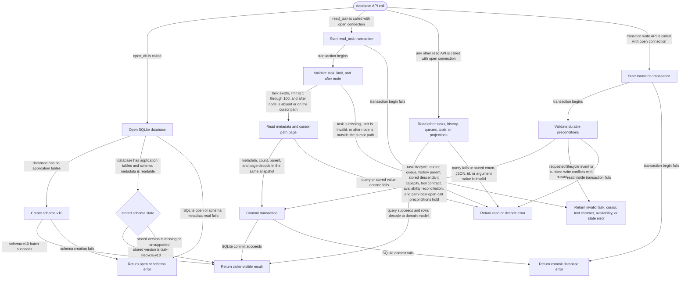

# db

<!-- selvedge-package-readme
package: selvedge-db
freshness_fingerprint: e8ae5889ab638d94ec625237e6ac2d894e32743f
-->

This crate owns SQLite persistence for router-mediated Selvedge tasks.

Use it to create and open schema-v10 SQLite databases, create tasks with frozen tool contracts, reconcile task-local tool availability, atomically commit tool-result branches, persist task lifecycle transitions, queue user inputs, and read bounded task snapshots. Nonempty databases must match schema v10 exactly.

This crate is for SQLite persistence only. Runtime wait state, provider calls, tool execution, router registries, and event delivery live in other crates.

Resource boundaries:

- `create_history_node` inserts one history node. History parent links are a standalone graph.
- `create_root_task` inserts one task row at a caller-provided existing `cursor_node_id`. Task parent links and history parent links are separate graphs.
- `create_root_task` stores one ordered `TaskToolSpec` set, including each tool's recovery policy, and the current fork and descendant limits with the new task. These values are immutable task contract data rather than references to a mutable catalog.
- `reconcile_task_tool_availability` compares stored task routes with the current runtime catalog and replaces only each task's unavailable-tool set. An empty set permits the complete frozen manifest; duplicate runtime names reject the transaction.
- `read_task_tool_state` returns the complete frozen manifest and its unavailable exceptions. `read_tool_manifest_for_task` therefore remains stable when runtime tools disappear.
- `commit_tool_result_branches` requires one calling-task branch and accepts zero or more new-child branches for an exact open function call on the calling task's current cursor path. Before writing, the same immediate transaction verifies that adding those children keeps the calling task and every ancestor within that ancestor's stored descendant limit; archived descendants still count. Every output is a sibling under that cursor. The calling branch then appends its supplied user messages and drains queued inputs; each child branch appends its own supplied user messages. Child task rows, parent edges, inherited tool contracts, recovery policies and unavailable exceptions, all history nodes, and every cursor are committed in one transaction.
- `read_open_function_calls_for_task` returns every call without an output on the current cursor path together with the recovery policy frozen for that task.
- `transition_task_status` applies the strict `active`, `frozen`, `stopped`, and `archived` lifecycle. Archived tasks reject runtime writes. A user input atomically reactivates a stopped task as part of the input commit.
- `list_runtime_tasks` and `load_runtime_task` select every non-archived task. Queued inputs remain attached when a task is archived.
- Function outputs store arbitrary JSON values. The schema permits outputs for the same call on sibling paths while rejecting a second output on one history path.
- `read_task` returns task identity, durable status, state version, cursor, optional parent, queued-input count, an exclusive `after_node_id` history page, and an exact `has_more` flag from one SQLite read transaction. Page limits are `1..=100`, and the after node must be on that task's cursor path.
- `read_task_parent_edges` returns durable task-layer parent edges for router snapshots and factory verification.
- `read_conversation_for_task` projects the cursor path into `Conversation.messages`: ordinary messages contain JSON strings, calls and outputs contain the shared JSON tool protocol, and every projected message records its source history node.
- A task cursor is a pointer into history, with no ownership claim over the pointed node.

Public transition writes keep cursor movement atomic with the history append they perform: user message commit, model reply with tool calls, assistant reply with queued-input drain, tool-result branch commit, queued input promotion, queue input, and archive.

## Package State Machine

The diagram records the package-level observable states and transition paths. Each edge label names the concrete condition checked at this package boundary.

