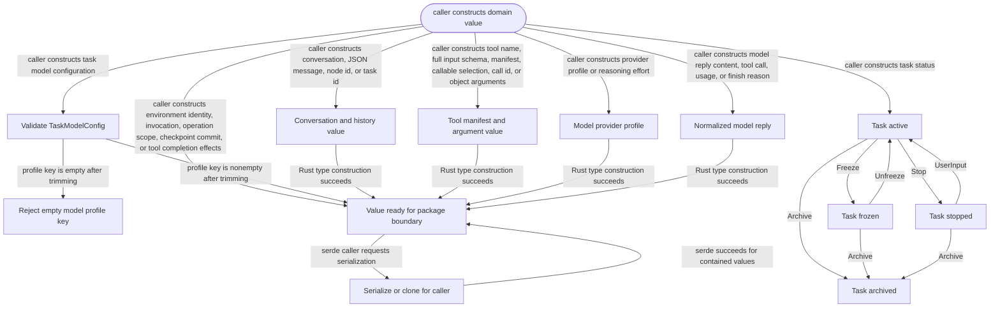

# domain-model

<!-- selvedge-package-readme
package: selvedge-domain-model
freshness_fingerprint: e99d11f4815a787c3603012bc259199c56c49066
-->

This crate defines Selvedge's shared task lifecycle and model-call domain values.

Use it to define conversation, tool, provider, and normalized model reply data structures.

`TaskModelConfig` keeps a nonempty model profile selection and its reasoning effort in one immutable value. Construction rejects an empty profile key; callers share the validated configuration through `Arc` from persistence to provider dispatch.

Tool input schemas and function-call arguments use `JsonObject`, backed by
`serde_json` with arbitrary-precision number decoding. `Conversation` stores one
ordered list of `ConversationMessage` values whose content is arbitrary JSON.
Text content is a JSON string. Function calls and outputs use typed JSON objects;
the message constructors and readers define their shared field contract without
adding another persisted content model.
`CallableTools` expresses either the complete manifest or an explicit
duplicate-free subset. It is provider-neutral selection state, not another tool
definition model.

`TaskStatus` is the durable task lifecycle. `TaskLifecycleEvent` defines its complete transition table. New tasks start active; archived tasks have no outgoing transition.

This crate is not for network access, database access, filesystem access, provider execution, or task runtime mutation.

Command environments have nominal identities independent of task parentage. `CommandInvocationId` pairs task and durable call-node identity; operation ordinals distinguish nested commands. `CommandOperationContext` carries trusted caller scope and current execution mode separately from optional journal identity. `CommandEnvironmentCommit` carries owned checkpoints and the expected revision; persistence validates admission and revision at commit. `ToolResultCompletion` distinguishes ordinary output completion from the command environment effects that must commit with it.

## Package State Machine

The diagram records the package-level observable states and transition paths. Each edge label names the concrete condition checked at this package boundary.

