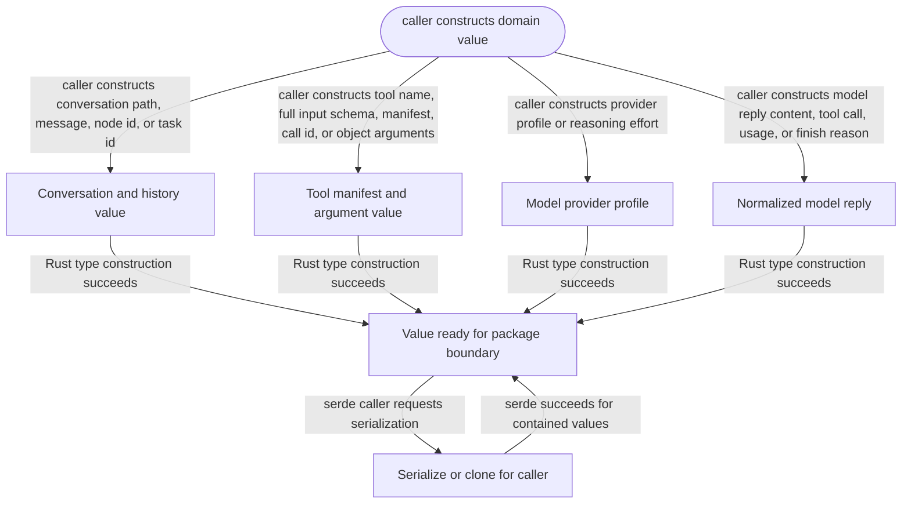

# domain-model

<!-- selvedge-package-readme
package: selvedge-domain-model
freshness_fingerprint: babd97983f5cec64b996241879634dc187cea019
-->

This crate defines the Selvedge domain model API slice used by model-call packages.

Use it to define conversation, tool, provider, and normalized model reply data structures.

Tool input schemas and function-call arguments use `JsonObject`, backed by
`serde_json` with arbitrary-precision number decoding. Conversation replay has
explicit function-call and function-output content variants, so callers do not
encode tool history as generic structured messages.

This crate is not for network access, database access, filesystem access, provider execution, or task runtime mutation.

## Package State Machine

The diagram records the package-level observable states and transition paths. Each edge label names the concrete condition checked at this package boundary.

