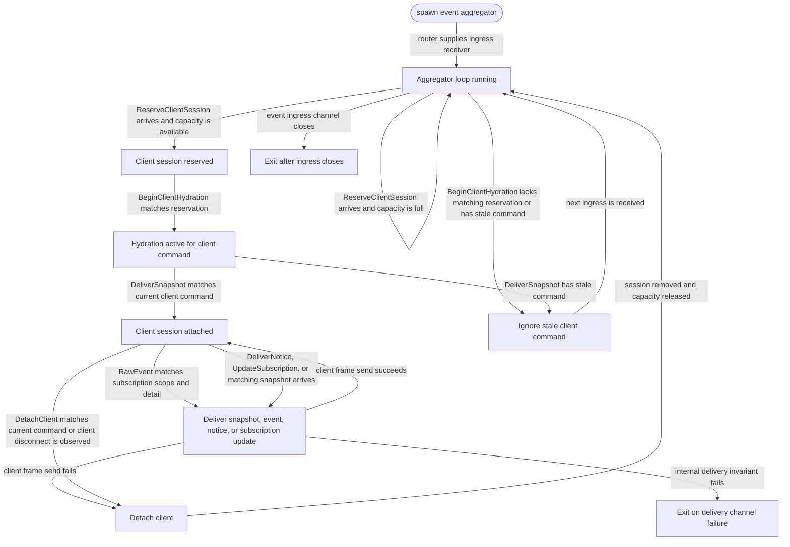

# events

<!-- selvedge-package-readme
package: selvedge-events
freshness_fingerprint: a67e2d81fdc7f3ba05792d32b764075cca3a22c0
-->

This crate runs the client outbound event aggregator task.

Use it from the router to register client outbound channels, deliver attach snapshots, update subscriptions, detach clients, and fan out raw command-model events as client frames.

This crate only receives router-mediated ingress and only sends `ClientFrame` values through router-provided client channels. It does not access the database, filesystem, network, API providers, tools, or task runtimes.

Client session capacity is admitted by `ReserveClientSession`. A matching `BeginClientHydration` consumes the reservation and installs or replaces the active session; stale begin, snapshot, notice, update, and detach controls are filtered by `ClientCommandId`.

## Package State Machine

The diagram records the package-level observable states and transition paths. Each edge label names the concrete condition checked at this package boundary.

