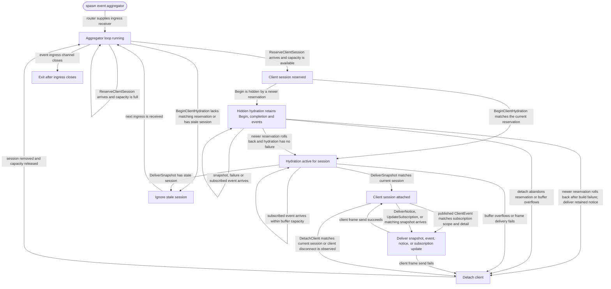

# events

<!-- selvedge-package-readme
package: selvedge-events
freshness_fingerprint: 4fa9a96ba214fc6cbe1bd81713d31e74c851458a
-->

This crate runs the client outbound event aggregator task.

Use it from the router to register client outbound channels, deliver attach snapshots, update subscriptions, detach clients, and fan out shared command-model events as client frames.

This crate receives reserved session controls, hydration results, and published events from the server pipeline and sends `ClientFrame` values through session-owned client channels. It does not access the database, filesystem, network, API providers, tools, or task runtimes.

Client session capacity is admitted by `ReserveClientSession`. A matching `BeginClientHydration` consumes the reservation and installs or replaces the active session; stale begin, snapshot, notice, update, and detach controls are filtered by fresh `ClientSessionIdentity` generations, independent of reusable wire command IDs.

Each pending reservation owns its optional initialized hydration: Begin, completion, and subscribed event buffer. When a replacement reservation rolls back, the exposed hydration delivers its retained snapshot first, followed by buffered events newer than the snapshot. A retained failure delivers its notice and closes the restored session. Both installed and pending buffers enforce the configured limit. Event filtering borrows the shared `ClientEvent`; accepted payloads are cloned only for actual buffering or delivery. All state transitions and bounded `try_send` delivery are synchronous.

## Package State Machine

The diagram records the package-level observable states and transition paths. Each edge label names the concrete condition checked at this package boundary.

