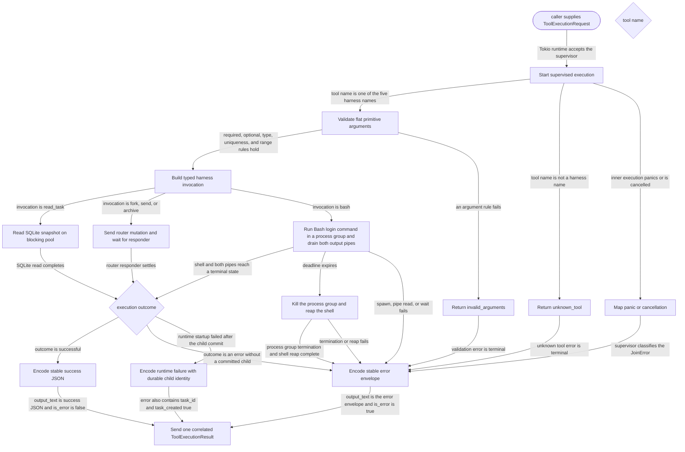

# harness

<!-- selvedge-package-readme
package: selvedge-harness
freshness_fingerprint: babb6418e9c084d4b3f2c1353542324d866657e0
-->

This crate implements Selvedge task self-orchestration and bounded Bash command execution for model tool calls.

Use it for the five harness tool manifests, typed invocation parsing, argument validation, SQLite-backed task reads, router-mediated task mutations, non-interactive Bash commands, stable JSON output, and the production `ToolExecutionSpawner`.

Calling task identity and complete function-call correlation come from `ToolExecutionRequest`, not model arguments. SQLite reads run on Tokio's blocking pool. Fork, send, and archive wait for typed router responders, so enqueueing a command is never reported as business success.

`bash` runs `/bin/bash -lc` with null stdin and inherits the server process working directory and environment. Its timeout defaults to 30 seconds and accepts 100 through 120000 milliseconds. Stdout and stderr are drained concurrently, each retains at most 65536 bytes, and the result reports truncation separately. Zero and nonzero exits are successful tool executions; signal termination is represented by a null `exit_code`.

Each Bash invocation owns a process group. A timeout sends `SIGKILL` to that group, waits for the shell and pipe readers to settle, and returns `command_timed_out`; the same group guard prevents a cancelled or panicking invocation from leaving command processes behind. Background sessions, PTYs, stdin writes, policy, approval, and sandboxing are outside this crate.

The executor supervises each request in an inner Tokio task and attempts exactly one terminal `ToolExecutionResult` delivery. The result copies the request's task, run, function-call node, function-call id, and tool name unchanged. A panic or cancelled inner task becomes a correlated error result instead of leaving the calling runtime waiting forever.

When a fork transaction has already created a durable child but runtime startup fails, the typed error preserves that child as `task_id` with `task_created: true`. The protocol does not imply that the child was rolled back.

## Package State Machine

The diagram records the package-level observable states and transition paths. Each edge label names the concrete condition checked at this package boundary.

