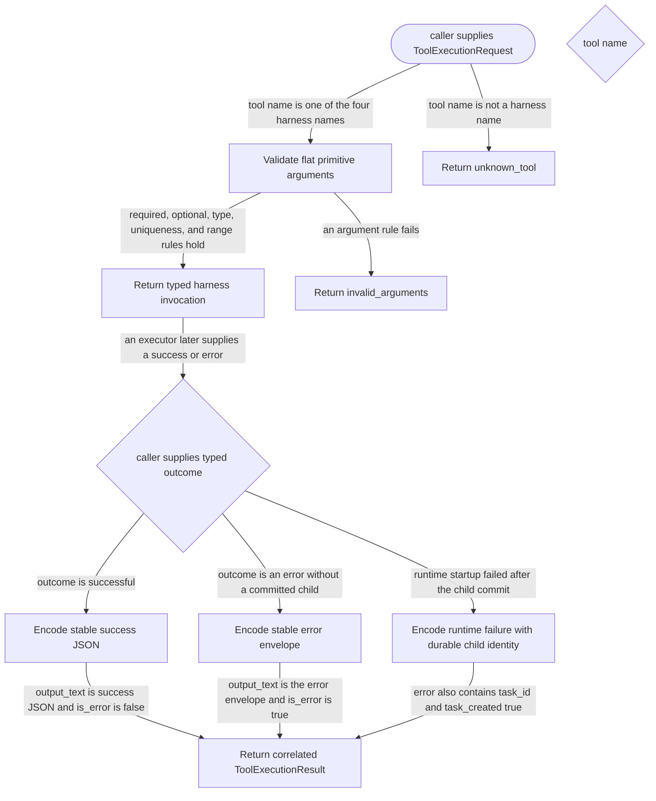

# harness

<!-- selvedge-package-readme
package: selvedge-harness
freshness_fingerprint: 1111a356944d1d1cb3cc33dcb9e70a5f452060c4
-->

This crate defines the model-visible protocol for Selvedge task self-orchestration.

Use it for the four harness tool manifests, typed invocation parsing, argument validation, typed success projections, stable JSON output, and correlated `ToolExecutionResult` construction.

This crate does not execute tools, access storage, coordinate runtimes, or define task lifecycle states beyond `active` and `archived`. Calling task identity and function-call correlation come from `ToolExecutionRequest`, not model arguments.

When a fork transaction has already created a durable child but runtime startup fails, the typed error preserves that child as `task_id` with `task_created: true`. The protocol does not imply that the child was rolled back.

## Package State Machine

The diagram records the package-level observable states and transition paths. Each edge label names the concrete condition checked at this package boundary.

