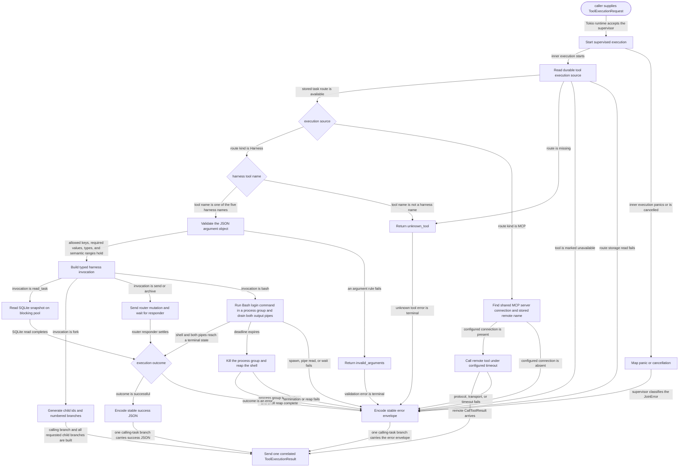

# harness

<!-- selvedge-package-readme
package: selvedge-harness
freshness_fingerprint: 0b591246f2b97d8ab9c6a565c938f5d0b266dce8
-->

This crate implements Selvedge task self-orchestration, bounded Bash command execution, and stdio MCP client execution for model tool calls.

Use it for the five harness tool manifests, complete JSON input schemas, typed invocation parsing from JSON objects, argument validation, SQLite-backed task reads, router-mediated task mutations, non-interactive Bash commands, MCP discovery and calls, stable JSON output, and the production `ToolExecutionSpawner`.

Calling task identity and complete function-call correlation come from `ToolExecutionRequest`, not model arguments. SQLite reads run on Tokio's blocking pool. Send and archive wait for typed router responders, so enqueueing a command is never reported as business success.

`McpConnectionSet` starts each configured command in its own process group, completes MCP initialization, and consumes every page from `tools/list`. Each incoming JSON-RPC frame is limited to 4 MiB, and discovery rejects a complete catalog above 1024 tools or 4 MiB of serialized tool definitions. A discovered tool becomes `mcp__<normalized server id>__<normalized remote name>` only when that name is valid and unique and the tool does not require MCP task-mode execution. Missing descriptions receive a stable route-derived description so every definition satisfies the durable task contract.

The production `ToolExecutor` reads each call's task-owned execution source and limits before dispatch. An unavailable tool fails before execution. Harness routes use the five built-in implementations; MCP routes use the discovered server connection and stored remote tool name under that server's timeout. Connections are shared across concurrent calls and retained separately from their cloneable peers so shutdown can close each child service exactly once. Shutdown terminates the server process group and reaps the direct child, so descendants cannot survive a normal close or a dropped connection future. A complete MCP `CallToolResult` remains arbitrary JSON in the ordinary calling-task branch, and `isError: true` marks that branch as an error without rewriting the remote result.

`fork_task` accepts `child_count` from 1 through `HarnessConfig::max_children_per_fork` and an optional `messages` string array of the same length. It creates one calling-task branch with JSON number `0` and one new-child branch per requested child with JSON numbers `1` through `child_count`; each aligned initial message is attached to its child branch and is not part of the branch output. The executor generates child task ids only. Core owns the later transactional branch commit and runtime startup, while the database enforces the configured complete-descendant limit.

Every built-in schema is a closed object with typed, described properties and an explicit required set. Runtime parsing still owns semantic checks such as non-whitespace strings and numeric ranges. Task history projects function-call arguments as their original JSON object, including nested objects, arrays, and nulls.

`bash` runs `/bin/bash -lc` with null stdin and inherits the server process working directory and environment. Its timeout defaults to 30 seconds and accepts 100 through 120000 milliseconds. Stdout and stderr are drained concurrently, each retains at most 65536 bytes, and the result reports truncation separately. Zero and nonzero exits are successful tool executions; signal termination is represented by a null `exit_code`.

Each Bash invocation owns a process group. A timeout sends `SIGKILL` to that group, waits for the shell and pipe readers to settle, and returns `command_timed_out`; the same group guard prevents a cancelled or panicking invocation from leaving command processes behind. Background sessions, PTYs, stdin writes, policy, approval, and sandboxing are outside this crate.

The executor supervises each request in the single Tokio task returned to the router and attempts exactly one terminal `ToolExecutionResult` delivery. The result copies the request's task, run, function-call node, function-call id, and tool name unchanged. Ordinary tools and terminal executor failures produce one calling-task branch, and a panic becomes a correlated error branch instead of leaving the calling runtime waiting forever. Cancelling and joining the returned handle drops the execution future itself, so Bash process cleanup and MCP request cancellation remain inside the router's shutdown barrier. This crate does not implement MCP resources, prompts, sampling, elicitation, HTTP transports, or task-mode calls.

## Package State Machine

The diagram records the package-level observable states and transition paths. Each edge label names the concrete condition checked at this package boundary.

