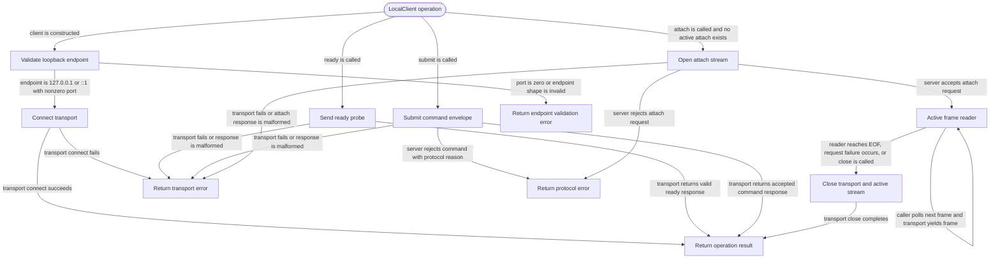

# local-client

<!-- selvedge-package-readme
package: selvedge-local-client
freshness_commit: f86607e521e640e17d56a038e67d8dffa64fbdda
-->

This crate owns the process-local client handle for talking to an existing Selvedge localhost server.

Use it to validate localhost endpoint configuration, connect through a caller-provided `LocalTransport`, run ready probes, submit local protocol commands, open one attach stream, and close the underlying transport.

`LocalEndpoint` is structured as loopback TCP by construction: `TcpIpv4 { port }` means `127.0.0.1:<port>`, and `TcpIpv6 { port }` means `[::1]:<port>`. Port `0` is invalid.

An active attach stream has one client-owned frame reader. `close()` and request failures close the active stream, drop the inner transport stream, and wake a pending reader so its next poll completes.

This crate does not start the server, call systemd, select an IPC transport, inspect command payload schemas, cache snapshots, or access router/events/client-sync mailboxes directly.

## Package State Machine

The diagram records the package-level observable states and transition paths. Each edge label names the concrete condition checked at this package boundary.

