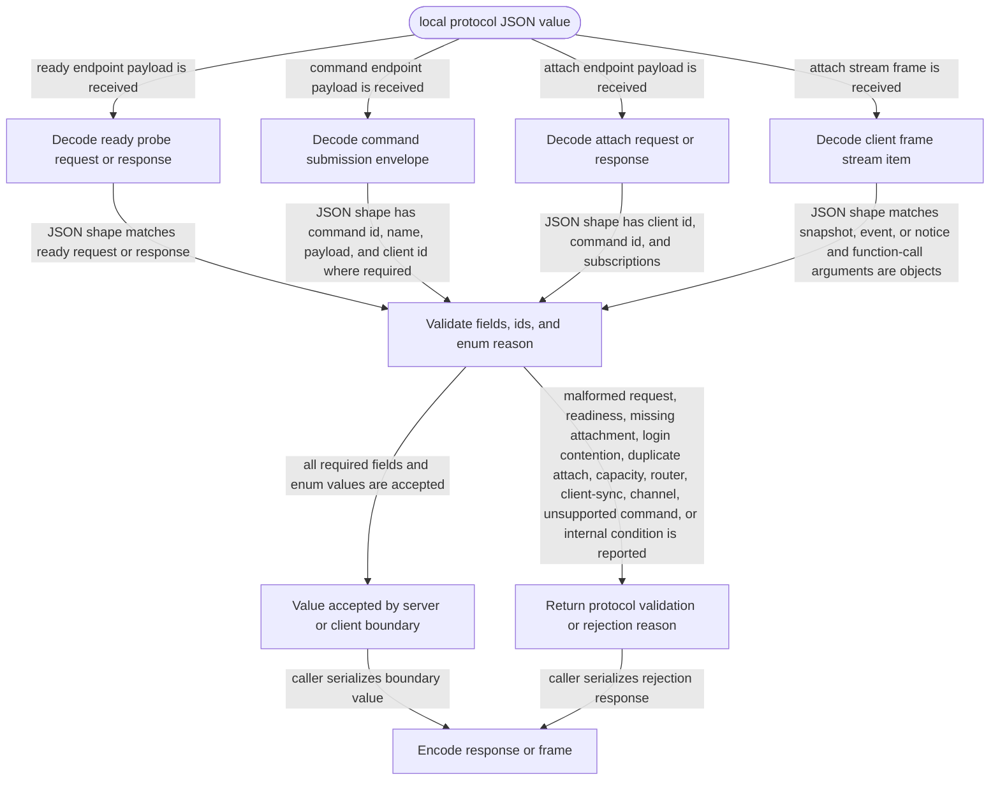

# local-protocol

<!-- selvedge-package-readme
package: selvedge-local-protocol
freshness_fingerprint: 8310baa0783f66b920993a0c64fdfda833171e39
-->

This crate defines the localhost protocol data model shared by the Selvedge server, root CLI, local client, TUI, and web client.

Use it for serializable ready probes, command submission envelopes, attach requests, attach responses, client subscriptions, client frames, snapshots, projections, events, and validation errors.

Function-call history projections expose arguments as one JSON object, and function outputs expose their original JSON value. Nested objects, arrays, nulls, and exact JSON numbers therefore cross the local boundary without being flattened or stringified.

Task projections expose the durable active, frozen, stopped, and archived lifecycle states without deriving runtime state in this protocol crate.

This crate does not access the network, database, filesystem, runtime, or mailbox. HTTP transport limits, authentication, payload schemas, and task existence checks are enforced by the crates that own those boundaries.

Command rejection and attach rejection use separate reason enums. Command rejection must cover malformed request, server readiness, missing client attachment, login contention, unsupported command, router mailbox closure, and internal failure. Attach rejection must cover malformed request, server not ready, duplicate active attach, client registry capacity exhaustion, router mailbox closure, client-sync unavailability, attach channel creation failure, and internal failure.

`LocalCommandKind` identifies the supported local command vocabulary (`login-chatgpt` and `list-models`) and owns parsing and canonical names. Request envelopes retain the received name so servers can return an explicit unsupported-command rejection.

Client and command identifiers are nonempty and at most `MAX_LOCAL_IDENTIFIER_BYTES` (1024 UTF-8 bytes), keeping correlation metadata bounded even on error paths. `MAX_LOCAL_FRAME_BYTES` is the shared encoded NDJSON item budget (4 MiB excluding the newline). A frame that exceeds that budget is replaced by `LocalStreamErrorReason::FrameTooLarge` and terminates attach. Snapshots are atomic: a consumer receives the complete snapshot or this explicit error, never a silently truncated history. Paging is not part of the current protocol.

## Package State Machine

The diagram records the package-level observable states and transition paths. Each edge label names the concrete condition checked at this package boundary.

