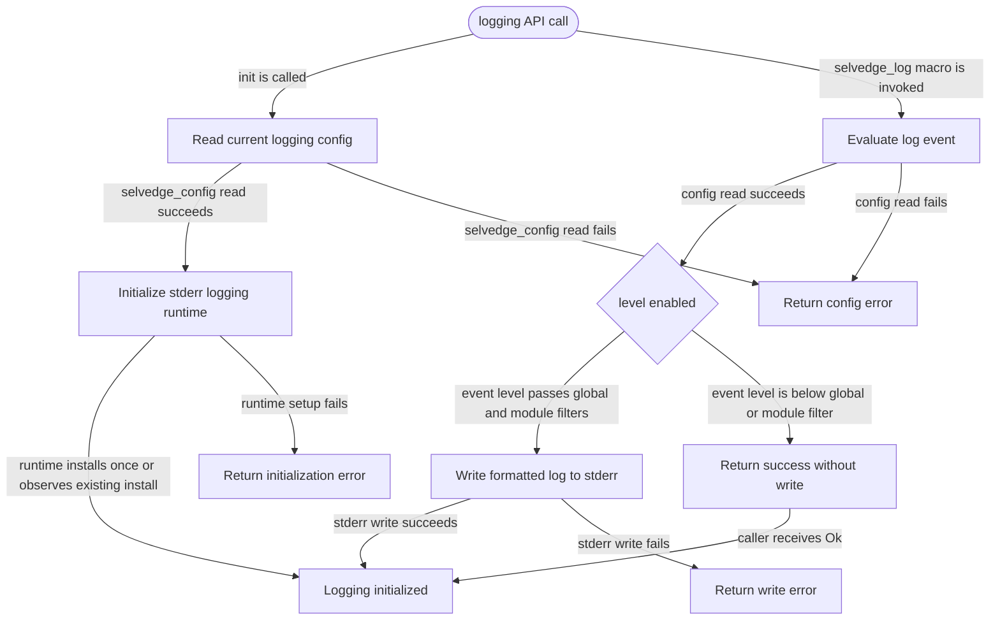

# logging

<!-- selvedge-package-readme
package: selvedge-logging
freshness_commit: 592f95539c225023a2f2d66f8096a3f85ac304ee
-->

## This crate is for

This crate is the project logging entrypoint.

Use it to:

- initialize the project logging runtime once
- write logs through the single `selvedge_log!` macro
- synchronously write project logs to stderr through one direct runtime

## This crate is not for

This crate is not for:

- owning a second copy of runtime config
- asking callers to create logger objects or contexts
- making callers hand-write module names
- bridging dependency `log!` or `tracing!` output into this module

Those responsibilities stay with `config` or are handled internally by the
macro and the logging runtime.

## Quick start

```no_run
use selvedge_config::init as init_config;
use selvedge_logging::{LogLevel, init, selvedge_log};

fn main() -> Result<(), Box<dyn std::error::Error>> {
    init_config()?;
    init()?;

    selvedge_log!(LogLevel::Info, "router started")?;
    selvedge_log!(LogLevel::Warn, "target thread not found"; target = "indexer")?;

    Ok(())
}
```

## Call site model

Callers only do one thing: emit a log with `selvedge_log!`.

- level is explicit
- message is explicit
- extra fields are optional
- module path, file, and line are filled by the macro

```no_run
# use selvedge_logging::{LogLevel, selvedge_log};
# selvedge_log!(LogLevel::Info, "worker started")?;
# selvedge_log!(LogLevel::Error, "send failed"; worker = "worker-2", reason = "channel closed")?;
# Ok::<(), Box<dyn std::error::Error>>(())
```

## Config interaction

This crate does not cache logging config internally.

Each log emission checks the current effective config through `selvedge_config`,
so updates to `logging.level` or `logging.module_levels` apply to subsequent log
calls without a separate reload step.

Callers must initialize `selvedge_config` before calling `selvedge_logging::init()`.

## Package State Machine

The diagram records the package-level observable states and transition paths. Each edge label names the concrete condition checked at this package boundary.


