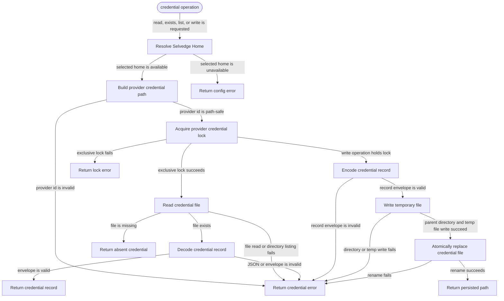

# model-credentials

<!-- selvedge-package-readme
package: selvedge-model-credentials
freshness_fingerprint: 0e8bfb0e956ed8da7b35c82442fb68a8557974e1
-->

This crate owns persisted model-provider credentials under the selected Selvedge Home.

Use it to read, check, list, and atomically write provider credential records at `<selvedge_home>/auth/model-providers/<provider_id>.json`.

This crate validates only the shared credential envelope: schema version, provider id, credential kind, and minimum payload shape. Provider-specific payload semantics belong to each provider adapter.

## Package State Machine

