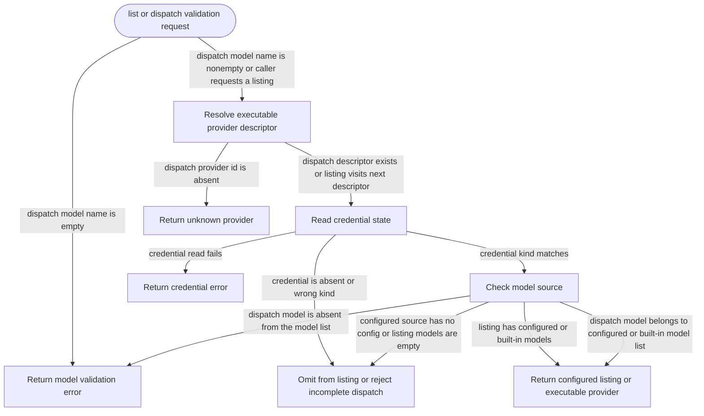

# model-providers

<!-- selvedge-package-readme
package: selvedge-model-providers
freshness_fingerprint: eea2ad559099655a32cf5f56a9f56ad2c648749e
-->

This crate owns the model provider registry and the shared configured-provider rules.

Use it to resolve provider descriptors, check whether a provider is configured, validate dispatch targets, and build the configured provider/model listing for local operations.

`ExecutableProvider` is the authoritative executable identity and supplies its canonical provider id. A descriptor selects an executable provider, its credential requirement, and either configured or built-in model names. Successful dispatch validation returns the executable identity for the API adapter's exhaustive match. Adding an enum variant requires adding its adapter branch.

The default registry exposes ChatGPT. Its fixed descriptors must validate; invalid built-in descriptors fail loudly rather than silently producing an empty registry.

## Package State Machine

