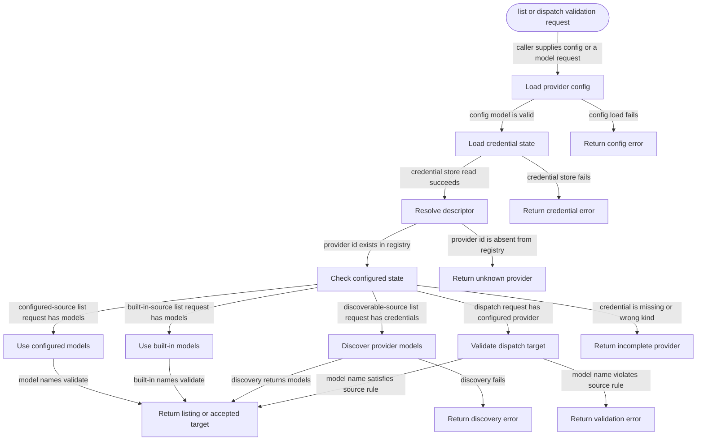

# model-providers

<!-- selvedge-package-readme
package: selvedge-model-providers
freshness_commit: 636fd61c9fc62b053c401426481a47ea5f0c066b
-->

This crate owns the model provider registry and the shared configured-provider rules.

Use it to resolve provider descriptors, check whether a provider is configured, validate dispatch targets, and build the configured provider/model listing for local operations.

Provider adapters own provider-specific request execution and discovery. This crate keeps provider id, credential kind, model source, and completion rules in one place.

## Package State Machine

