# router

<!-- selvedge-package-readme
package: selvedge-router
freshness_fingerprint: 431a09c80aadba1f9dca08fd483d54db6f6758be
-->

This crate owns the Selvedge router actor.

Use it to spawn the process-local mailbox that routes client commands, task runtime output, API output, tool output, factory-created task runtimes, and events ingress. The router owns the live task runtime registry, the join handles for in-flight model calls and tool executions.

This crate commits task lifecycle transitions through the database boundary. It does not execute provider calls, tool calls, history transitions, or client delivery directly. It delegates those effects to the API, configured tool executor, task-runtime factory, core runtime, database, and events crates.

`RouterStartArgs` passes API execution config to `selvedge-api`; provider selection stays in each model-call request.

Router ingress is unbounded. The router is the lifecycle coordinator for task runtimes, and runtime-to-router output must enqueue without waiting for router mailbox capacity while the router is synchronously stopping a runtime. The router handle owns the strong ingress sender; runtime, API, tool, and factory producers receive weak ingress senders so dropping external ingress owners closes the router mailbox.

Core output routing is task-id based. Router ingress order is the lifecycle linearization point: effects registered before archive are cancelled by archive, while model or tool requests handled after archive are rejected by the durable status gate.
Core output with an embedded task id must match the envelope task id before the router starts model calls, tool executions, or event publication.

The current user-input command remains owned by the router while it awaits missing-runtime creation or replaces a closed mailbox. Only the task runtime settles it after SQLite commits. Freeze, unfreeze, stop, and archive commit directly through the database boundary and return the persisted status. Factory failures are mapped to task missing, task archived, persistence failure, or runtime unavailable, and router shutdown fails unread task commands before releasing their responders.

Core commits tool-result branches before requesting runtime startup. `CoreOutputMessage::EnsureTaskRuntimes` sends the committed new task ids to the router, and each id enters the same missing, live, and stopping runtime lifecycle as every other task.

Model calls and tool executions are task-owned router effects. Their terminal output removes and joins the matching handle before delivery to the task runtime. Archiving one task cancels and joins its remaining effects; router shutdown closes ingress, cancels and joins every remaining effect, then shuts down runtimes. `RouterExitStatus::Stopped` therefore cannot leave a router-started model or tool task running.

Attach routing is an admission boundary. `RouterCommand::AttachClient` sends `ReserveClientSession` to events and answers the command's admission responder with the reservation result; snapshot hydration starts later through client-sync after server observes the accepted admission.

## Runtime Ownership Decision

The router's runtime uniqueness invariant is route ownership: for one `TaskId`, at most one `TaskRuntimeSender` in `task_runtime_registry` may receive router task commands at a time. Runtime creation and recovery are awaited within the serial router command handler, so their direct return values need no effect-correlation or deferred-command protocol.

`TaskRuntimeControl` contains no task status. A lifecycle transition notifies the live actor so it reloads durable status. Archive waits for the actor to exit after observing `archived`; process shutdown requests an immediate shutdown. Both paths use the same actor-exit barrier.

Runtime ownership flows as missing, live, shutting down, then released. A successful creation must enqueue `Start` before the router routes the current command to that runtime. During shutdown, the router actor waits on the control barrier. After `TaskRuntimeShutdownResult` returns, the router removes the registry entry only if it is still the same control block.

TODO: Define client data synchronization outside this crate. The router forwards client session controls and runtime diagnostics; it does not produce client-visible task, history, parent-edge, snapshot, or subscription-filtered data views.

## Package State Machine

The diagram records the package-level observable states and transition paths. Each edge label names the concrete condition checked at this package boundary.

```mermaid
flowchart TD
  Start([spawn router])
  Loop[Router mailbox loop]
  Command[Handle RouterCommand]
  CoreOutput[Handle CoreOutputEnvelope]
  ApiOutput[Handle ApiOutputEnvelope]
  ToolOutput[Handle ToolExecutionResult]
  RuntimeLive[Runtime registered live]
  CreateRuntime[Await runtime creation or recovery]
  RuntimeStopping[Runtime shutdown barrier in progress]
  StatusCommit[Commit task lifecycle transition]
  EffectLive[Model call or tool execution handle owned by router]
  EffectStopping[Cancel and join task-owned effects]
  ModelSuppressed[Return ModelCallNotStarted]
  ToolRejected[Reject archived tool request]
  TaskResponseSettled[Task command response failed]
  Events[Forward event control]
  ErrorNotice[Publish diagnostic notice]
  Shutdown[Begin shutdown after ingress closes]
  ShutdownRuntimes[Stop runtimes and drain unread ingress]

  Start -->|router handle is created| Loop
  Loop -->|RouterCommand arrives| Command
  Loop -->|CoreOutputEnvelope arrives| CoreOutput
  Loop -->|ApiOutputEnvelope arrives| ApiOutput
  Loop -->|ToolExecutionResult arrives| ToolOutput
  Command -->|AttachClient reservation send succeeds| Events
  Command -->|ensure or recovery requires missing runtime creation| CreateRuntime
  CoreOutput -->|committed branch task ids need runtimes| CreateRuntime
  Command -->|user input targets live runtime| RuntimeLive
  Command -->|freeze, unfreeze, stop, or archive is received| StatusCommit
  StatusCommit -->|non-archive status commits| RuntimeLive
  StatusCommit -->|archive commits| EffectStopping
  StatusCommit -->|transition is invalid or persistence fails| TaskResponseSettled
  Command -->|validation, missing runtime, events, database, or factory dispatch fails| ErrorNotice
  CreateRuntime -->|creation returns handles and Start enqueues| RuntimeLive
  CreateRuntime -->|creation fails or Start cannot enqueue| TaskResponseSettled
  TaskResponseSettled -->|typed failure is sent exactly once| ErrorNotice
  RuntimeLive -->|runtime send succeeds| Loop
  RuntimeLive -->|runtime send fails and recreation cannot accept the command| TaskResponseSettled
  RuntimeStopping -->|TaskRuntimeControl shutdown result resolves| Loop
  CoreOutput -->|task id matches an event publication| Events
  CoreOutput -->|task id matches a model or tool request and effect id is unique| EffectLive
  CoreOutput -->|model status gate observes frozen or stopped| ModelSuppressed
  CoreOutput -->|tool status gate observes archived| ToolRejected
  ModelSuppressed -->|typed result is delivered to the live runtime| RuntimeLive
  ToolRejected -->|diagnostic is published without starting an effect| ErrorNotice
  CoreOutput -->|task id mismatch or downstream send fails| ErrorNotice
  ApiOutput -->|correlation matches an owned model effect| EffectLive
  EffectLive -->|terminal API or tool output arrives and its handle joins| RuntimeLive
  ApiOutput -->|correlation is unknown or runtime send fails| ErrorNotice
  ToolOutput -->|run id matches an owned tool effect| EffectLive
  ToolOutput -->|run id is unknown or runtime send fails| ErrorNotice
  Events -->|event ingress send succeeds| Loop
  Events -->|event ingress send fails| ErrorNotice
  ErrorNotice -->|diagnostic handling completes| Loop
  Loop -->|all router ingress senders are dropped| Shutdown
  Loop -->|StopRouter is received| Shutdown
  Shutdown -->|in-flight effects remain| EffectStopping
  Shutdown -->|no in-flight effects remain| ShutdownRuntimes
  EffectStopping -->|task-scoped handles are cancelled and joined| RuntimeStopping
  EffectStopping -->|all handles are cancelled and joined during shutdown| ShutdownRuntimes
  ShutdownRuntimes -->|unread task commands are failed| TaskResponseSettled
```

