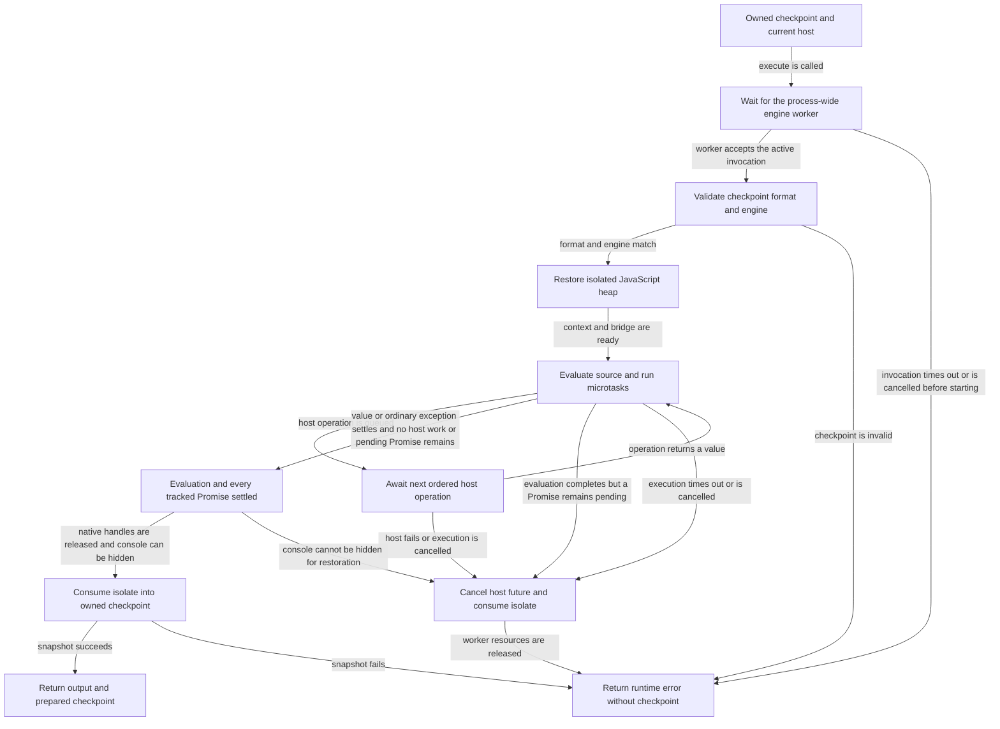

# selvedge-script-runtime

<!-- selvedge-package-readme
package: selvedge-script-runtime
freshness_fingerprint: 035cdb6d4f79ecd641cd8c1d1a1cad0c14cc5a19
-->

This package executes JavaScript against an owned V8 heap checkpoint. It has no
task, database, router, filesystem, process, or network dependency. The caller
supplies the current invocation's `ScriptHost` and persists the returned state.

`ScriptRuntime::new(bootstrap)` creates the base environment. Each `execute`
restores an owned checkpoint, evaluates ordinary top-level JavaScript (including
`await`), drains host operations and microtasks, and consumes the isolate into a
new checkpoint. Copying checkpoint bytes copies variables, captured closures,
and module exports without replaying source. Checkpoints have one current format
and are restricted to the matching runtime and V8 version.

The native `__selvedgeHost(name, arguments)` function returns a Promise. Host
ordinals and the current host are held in Rust, outside the copied heap. Host
errors abort execution even when JavaScript attempts to catch them. Command
denials that JavaScript may inspect should instead be ordinary command values.
`HostResponse::ModuleError` rejects the module-loading Promise and can be caught
by JavaScript; `ScriptHostError` aborts the invocation without a new checkpoint.

`await modules.load(path)` loads a CommonJS-style JavaScript module through the
host. Modules assign `module.exports` or `exports`; they may await
`modules.load(relativePath)`. Export objects, module-local closures, source text,
and the module cache are checkpointed. `modules.source(path)` and `modules.list()`
expose cached source and names. ES import syntax and TypeScript are not supported.

Successful outputs contain `value`, `value_type`, and `logs`. Script
exceptions additionally contain `error` and set `is_error`; settled state is
still returned. A successful result that cannot be encoded as JSON, such as a
cyclic object or an object containing a BigInt, returns its inspector description
without reevaluating source or discarding state. Detached Promise rejections
that remain unhandled after draining also produce ordinary script errors;
rejections handled before that boundary do not.
Function source remains available through JavaScript
`Function.prototype.toString`. The bootstrap owns command descriptions.
`environment.names()` discovers global properties and top-level lexical names;
new lexical declarations appear in this list after their invocation completes.
Discovery metadata is returned only when the script asks for it.

`Date` and `Math.random` retain their normal JavaScript behavior. The caller must
validate journaled host observations on replay and reject a diverging operation
prefix before new effects. Host operations complete in their Rust-assigned order.
Weak references, shared memory, WebAssembly, `Intl`, and `Temporal` are unavailable
because their external or collection-dependent state is not part of the
checkpoint contract.

One process-wide worker owns V8 initialization and serializes complete isolate
lifetimes. V8 150's snapshot creation mutates shared read-only heap state; API
callers may submit concurrent executions, but their JavaScript runs in queue
order. Separate checkpoints and bootstraps remain independent.

Execution has a wall-time limit, including queue waits, host waits, and CPU loops.
Dropping an execution future cancels that invocation and its pending host future.
Cancellation of a queued invocation returns without waiting for the active
invocation, and the worker skips the cancelled entry. Runtime failures do not
return a replacement checkpoint; the caller retains its previous checkpoint.
Detached host work is drained, and context Promise hooks reject any remaining
pending Promise, including suspended pure-JavaScript async continuations, before
a checkpoint can be returned. This check is conservative: an unused unresolved
Promise also prevents checkpointing.
The global `console` property must remain configurable. Before returning a
checkpoint, the runtime hides that property for inspector restoration; attempts
to make it nonconfigurable fail the invocation and preserve the caller's previous
checkpoint. Housekeeping reads the actual V8 global object, so lexical bindings
such as `globalThis` or `JSON` do not redirect it.

## Package State Machine

