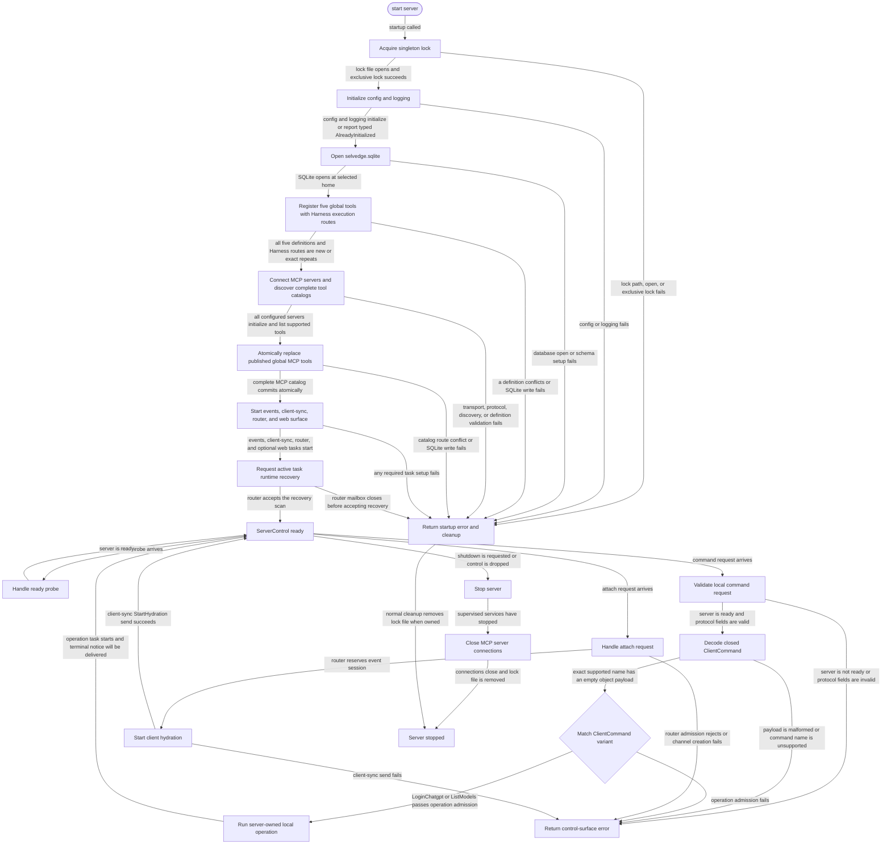

# server

<!-- selvedge-package-readme
package: selvedge-server
freshness_fingerprint: c84391948c596454859584049473e1c4de963c0f
-->

This crate owns the process-local Selvedge server lifecycle.

Use it to start the server runtime, hold the singleton lock, initialize config and logging, open the SQLite database at `<selvedge_home>/selvedge.sqlite`, install the five built-in harness tools, discover configured stdio MCP tools, start events, client-sync, router, and optional web surface tasks, recover active task runtimes, and expose the in-process `ServerControl` used by local clients and UI surfaces.

`ServerStartArgs` uses the current `selvedge-api` boundary: server passes `ApiExecutorConfig` into the router, and provider selection remains inside each model-call request. It also receives the effective harness limits and MCP server map from the configuration boundary; the descendant limit is installed at database open and the per-fork limit is shared by tool schemas and parsing. This crate does not own a provider registry.

After opening SQLite, startup registers the exact harness manifests idempotently as global tools with durable Harness execution routes. It then connects configured MCP servers, discovers their complete tool catalogs, and atomically replaces the published global MCP set before constructing the unified executor. Discovery and catalog conflicts fail startup before task recovery. The shared MCP connections stay alive for concurrent calls and close after the supervised services stop.

Function-call history projections carry one JSON object and function outputs carry one JSON value unchanged across the command-model and local-protocol boundary. The server does not flatten arguments or stringify outputs.

The singleton lock is `<selvedge_home>/server.lock`. The lock file is removed during normal shutdown and startup-failure cleanup.

Config and logging initialization recognize repeated initialization through their typed `AlreadyInitialized` variants. Every other initialization error remains a startup failure.

This crate exposes the in-process control surface, validates localhost bind targets, and accepts attach requests after router-mediated events reservation succeeds.

`ServerControl::attach_client` creates an internal client frame channel, sends router attach admission, sends `StartHydration` to client-sync after admission succeeds, and returns a local-protocol frame stream. Frames from `selvedge-events` are converted from command-model client frames into local-protocol frames without reordering.

Active, hydrated, closing, and cancellable-operation attach data shares one
process-local state lock. Admission and cancellation decisions therefore observe
one atomic attach state.

## Package State Machine

Client command requests decode through the private, closed `ClientCommand` enum.
The exact `login-chatgpt` and `list-models` names both require an empty JSON object
payload; malformed payloads and unsupported names remain distinct rejection
paths. An exhaustive match dispatches both variants through the injected
`LocalOperationExecutor`. Operations are admitted only for an attached client,
run outside the router mailbox, and deliver terminal notice frames.

The diagram records the package-level observable states and transition paths. Each edge label names the concrete condition checked at this package boundary.

