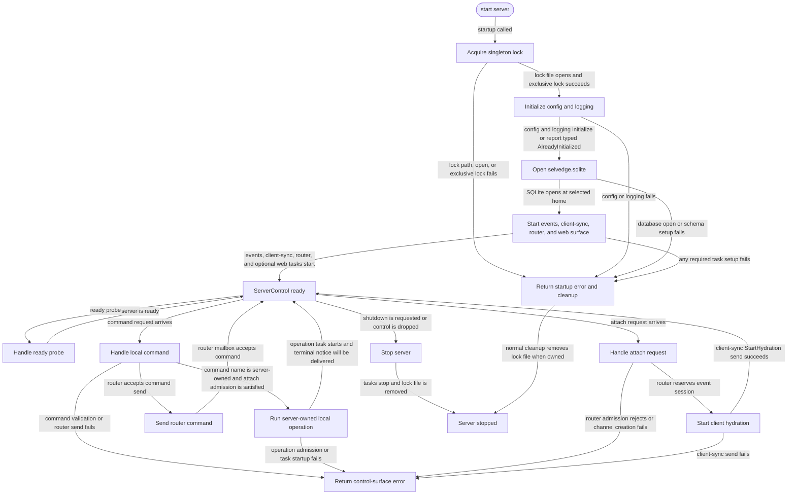

# server

<!-- selvedge-package-readme
package: selvedge-server
freshness_fingerprint: 35b8aa34f1874aef8f5e58fddbcbf3a57581efc6
-->

This crate owns the process-local Selvedge server lifecycle.

Use it to start the server runtime, hold the singleton lock, initialize config and logging, open the SQLite database at `<selvedge_home>/selvedge.sqlite`, start events, client-sync, router, and optional web surface tasks, and expose the in-process `ServerControl` used by local clients and UI surfaces.

`ServerStartArgs` uses the current `selvedge-api` boundary: server passes `ApiExecutorConfig` into the router, and provider selection remains inside each model-call request. This crate does not own a provider registry.

The singleton lock is `<selvedge_home>/server.lock`. The lock file is removed during normal shutdown and startup-failure cleanup.

Config and logging initialization recognize repeated initialization through their typed `AlreadyInitialized` variants. Every other initialization error remains a startup failure.

This crate exposes the in-process control surface, validates localhost bind targets, and accepts attach requests after router-mediated events reservation succeeds.

`ServerControl::attach_client` creates an internal client frame channel, sends router attach admission, sends `StartHydration` to client-sync after admission succeeds, and returns a local-protocol frame stream. Frames from `selvedge-events` are converted from command-model client frames into local-protocol frames without reordering.

Active, hydrated, closing, and cancellable-operation attach data shares one
process-local state lock. Admission and cancellation decisions therefore observe
one atomic attach state.

## Package State Machine

Server-owned local commands execute through the injected `LocalOperationExecutor`.
`list-models` and provider login operations are admitted only for an attached
client, run outside the router mailbox, and deliver terminal notice frames.

The diagram records the package-level observable states and transition paths. Each edge label names the concrete condition checked at this package boundary.

