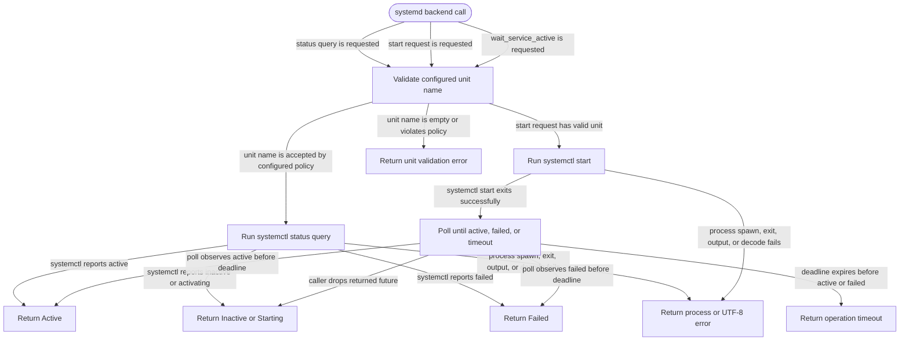

# systemd

<!-- selvedge-package-readme
package: selvedge-systemd
freshness_commit: 592f95539c225023a2f2d66f8096a3f85ac304ee
-->

This crate owns the root-CLI systemd boundary for the Selvedge server unit.

Use it to validate the configured `selvedge-server` unit name, query unit status with the configured operation timeout, request unit start with the configured operation timeout, and wait for systemd to report `Active` or `Failed`.

`wait_service_active` polls until the configured timeout. If the caller drops the returned future, polling stops and no `SystemdError` is returned.

This crate does not install, write, or modify unit files. It does not treat systemd `Active` as server readiness, stop the server, check localhost endpoints, send business commands, or access router/events/client-sync mailboxes.

## Package State Machine

The diagram records the package-level observable states and transition paths. Each edge label names the concrete condition checked at this package boundary.

