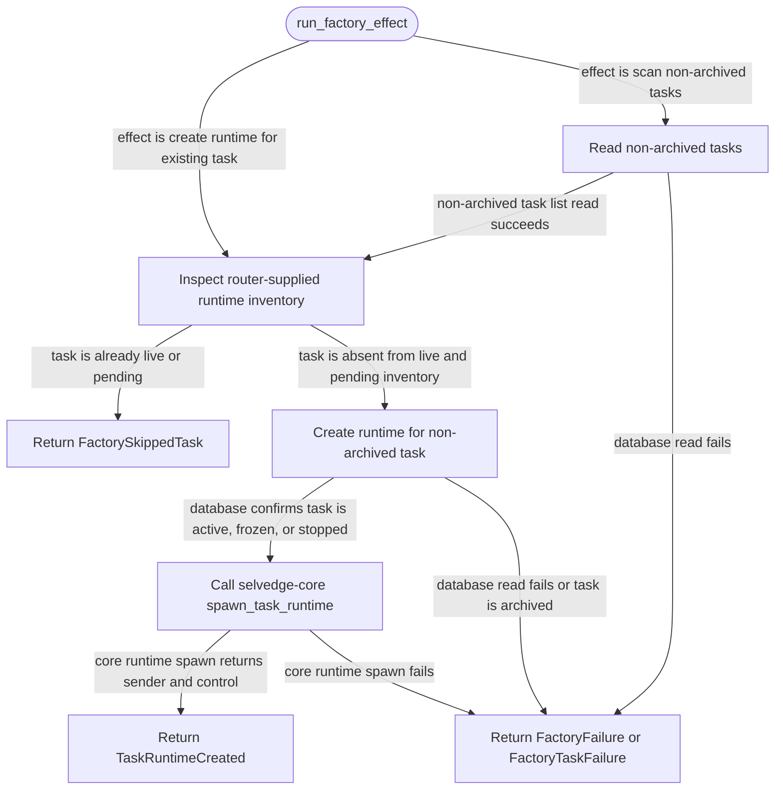

# task-runtime-factory

<!-- selvedge-package-readme
package: selvedge-task-runtime-factory
freshness_fingerprint: 879fe073fbd4553873694b20da0c916c45586922
-->

This crate runs one-shot factory effects for router-mediated task runtimes.

Use it to create a runtime for an existing non-archived task or scan all non-archived tasks and create missing runtimes. Active, frozen, and stopped tasks have runtimes. Archived tasks return a typed factory failure. The router runs `run_factory_effect` on Tokio's blocking pool and receives exactly one factory output envelope.

`FactoryRuntimeInventory` is supplied by the router from its current in-memory registry and pending-effect state. The factory uses it only to skip already live or pending task runtimes.

This crate is not for runtime registry ownership, task-local commands, provider calls, tool execution, direct event delivery, root task creation, or filesystem access.

## Package State Machine

The diagram records the package-level observable states and transition paths. Each edge label names the concrete condition checked at this package boundary.

