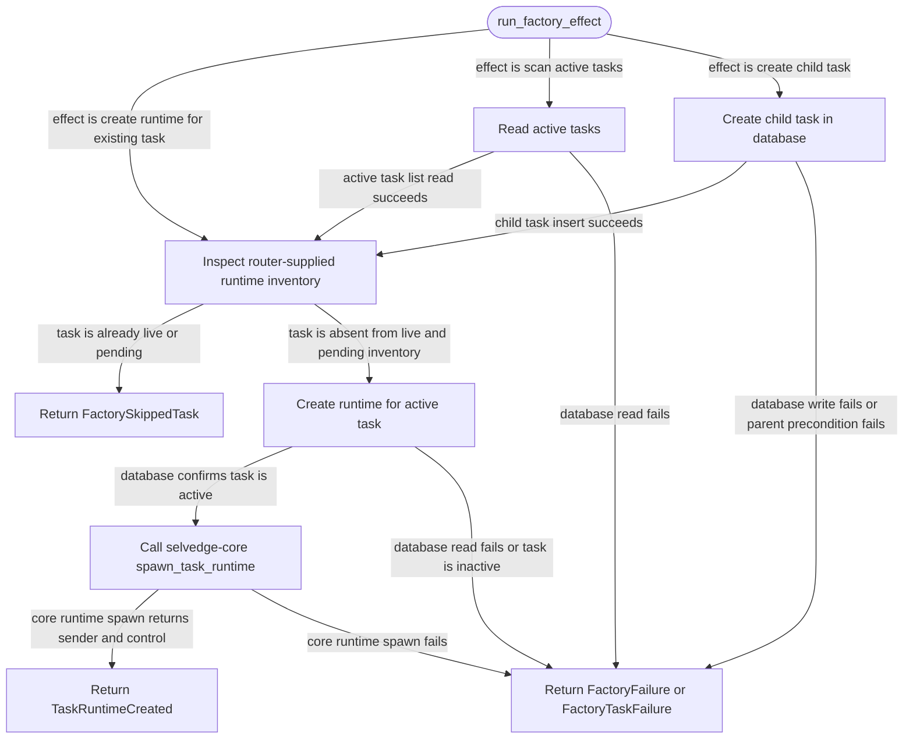

# task-runtime-factory

<!-- selvedge-package-readme
package: selvedge-task-runtime-factory
freshness_fingerprint: c96ef3da464823d0f590f3f562162d6a2c120850
-->

This crate runs one-shot factory effects for router-mediated task runtimes.

Use it to create a runtime for an existing active task, scan active tasks and create missing runtimes, or create a child task then create its runtime. The router calls `run_factory_effect` directly and receives exactly one factory output envelope as the return value.

`FactoryRuntimeInventory` is supplied by the router from its current in-memory registry and pending-effect state. The factory uses it only to skip already live or pending task runtimes.

This crate is not for runtime registry ownership, task-local commands, provider calls, tool execution, direct event delivery, root task creation, or filesystem access.

## Package State Machine

The diagram records the package-level observable states and transition paths. Each edge label names the concrete condition checked at this package boundary.

