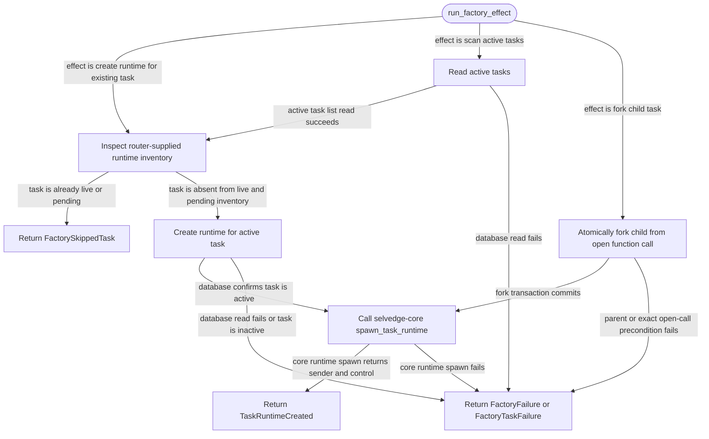

# task-runtime-factory

<!-- selvedge-package-readme
package: selvedge-task-runtime-factory
freshness_fingerprint: e261ad7f6a60a4f74f383c38e205a0f96047f30b
-->

This crate runs one-shot factory effects for router-mediated task runtimes.

Use it to create a runtime for an existing active task, scan active tasks and create missing runtimes, or atomically fork a child from an exact open function call before creating its runtime. The router runs `run_factory_effect` on Tokio's blocking pool and receives exactly one factory output envelope.

`FactoryRuntimeInventory` is supplied by the router from its current in-memory registry and pending-effect state. The factory uses it only to skip already live or pending task runtimes.

This crate is not for runtime registry ownership, task-local commands, provider calls, tool execution, direct event delivery, root task creation, or filesystem access.

Fork input contains the parent task, function-call node, function-call id, tool name, and child prompt. The database chooses the safe history branch point and creates the prompt; callers cannot supply a child cursor. If runtime spawn fails after commit, `FactoryFailure.task_id` is the durable child id.

## Package State Machine

The diagram records the package-level observable states and transition paths. Each edge label names the concrete condition checked at this package boundary.

