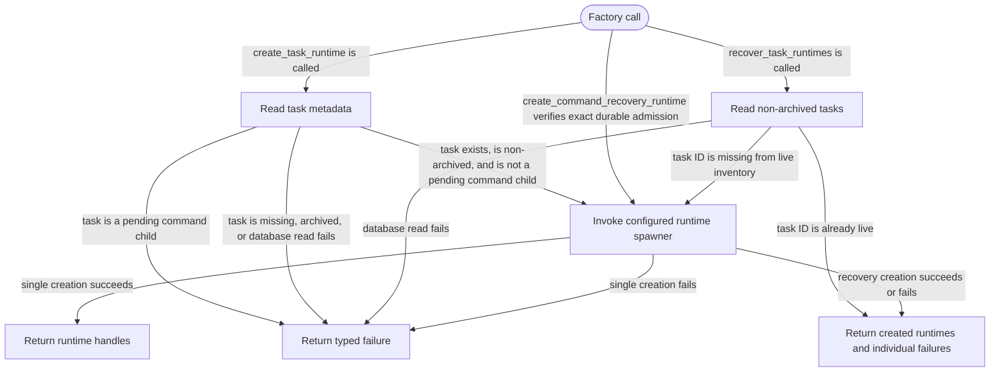

# task-runtime-factory

<!-- selvedge-package-readme
package: selvedge-task-runtime-factory
freshness_fingerprint: b461c57cae11dda77f42b3ea8ac7169e57485abe
-->

This crate creates task runtimes for the router through synchronous operations.

`create_task_runtime` checks task metadata and returns the core runtime handles or a typed missing, archived, database, or spawner failure. `recover_task_runtimes` scans non-archived tasks, skips the supplied live task IDs, and returns created runtimes and individual creation failures. Active, frozen, and stopped tasks are eligible once their pending command-child admission has completed. Pending children return `TaskPending` from direct creation and are omitted from recovery. `create_command_recovery_runtime` separately validates an exact admitted invocation and may create a recovery-only actor for an archived owner. The router calls these operations on Tokio's blocking pool and awaits their direct results before processing another command.

Runtime uniqueness, registration, the initial `Start` command, and shutdown belong to the router. This package does not introduce factory effect IDs, pending inventories, or output envelopes.

## Package State Machine

