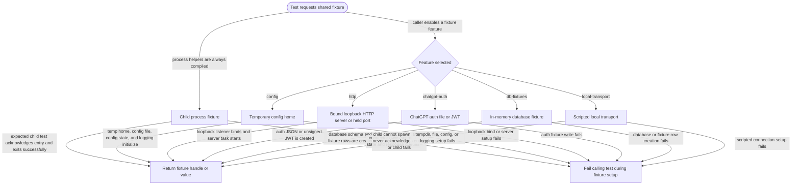

# test-support

<!-- selvedge-package-readme
package: selvedge-test-support
freshness_fingerprint: e3a179c6bf9404c8957d9a768b970fbcf1dc4a6f
-->

This crate provides shared fixtures for Selvedge integration tests.

Use narrow feature flags so each test crate imports only the fixture layer it needs:

- `config` initializes a temporary Selvedge home and global config/logging state.
- `http` owns bound loopback servers and held-port helpers with abort-on-drop server tasks.
- `chatgpt-auth` writes ChatGPT auth fixture files with a current `last_refresh`
  timestamp and unsigned JWT strings.
- `local-transport` provides a scripted local protocol transport for client and TUI tests. Each `FakeLocalConnector` owns its connection plan, so tests do not share a global plan or require a connection lock.
- `db-fixtures` provides downstream database setup helpers.

The helpers are test infrastructure only. Protocol-specific mock behavior stays in the test that owns the behavior contract.

## Package State Machine

The diagram records the package-level observable fixture states and transition paths. Each edge label names the concrete condition checked at this package boundary.

