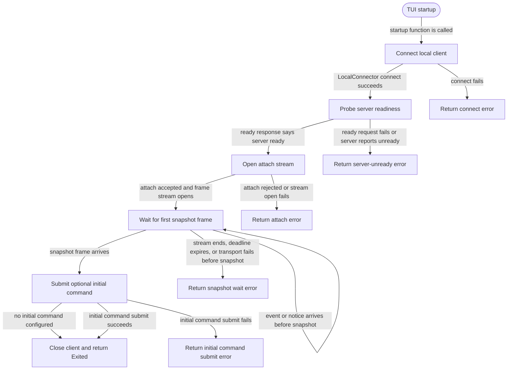

# tui

<!-- selvedge-package-readme
package: selvedge-tui
freshness_fingerprint: f3b6a94e7b1cb11ea0cb806a477142379322639e
-->

This crate owns the TUI startup boundary for attaching to an existing Selvedge local server.

Use it to connect through `selvedge-local-client`, probe readiness, open an attach stream, wait for the first snapshot, submit an optional initial command, close the client, and return a typed exit status. This entry point performs startup and an optional one-shot submission; it does not run an interactive terminal loop.

`run_tui` connects through the concrete HTTP localhost transport exposed by
`selvedge-local-client`. Transport injection stays private to state-machine
tests. Client and attach command identifiers are validated before the transport
connects.

## Package State Machine

The diagram records the package-level observable states and transition paths. Each edge label names the concrete condition checked at this package boundary.

