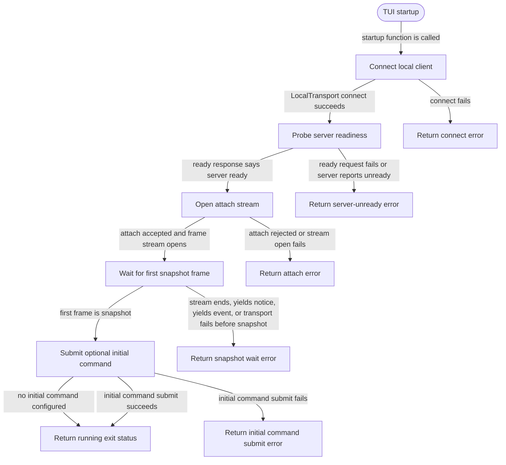

# tui

<!-- selvedge-package-readme
package: selvedge-tui
freshness_commit: fc2e3adc00d7d6076ee17f2b153d0b8fc8c312dd
-->

This crate owns the TUI startup boundary for attaching to an existing Selvedge local server.

Use it to connect through `selvedge-local-client`, probe readiness, open an attach stream, wait for the first snapshot, submit an optional initial command, and return a typed exit status.

The current entry point is generic over `LocalTransport` because the repository has not yet implemented the real localhost transport below `selvedge-local-client`.

## Package State Machine

The diagram records the package-level observable states and transition paths. Each edge label names the concrete condition checked at this package boundary.

