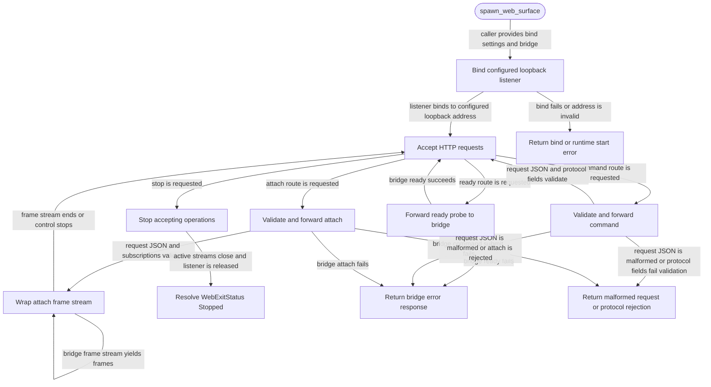

# web

<!-- selvedge-package-readme
package: selvedge-web
freshness_commit: f2a0e6aa7f63b0fb8b575fefc5026e0535a7e64f
-->

This crate defines the localhost HTTP ingress boundary used by `selvedge-server`.

Use it to pass HTTP bind settings, bridge requests, bridge futures, attach frame streams, runtime state, start errors, bridge errors, and the web control handle across package boundaries.

`spawn_web_surface` binds the configured loopback address and keeps that listener owned by the web task. `WebControl` exposes the request handling core used by local HTTP routes: `ready` forwards readiness probes, `submit_command` validates and forwards command requests, and `attach` validates and wraps bridge frame streams.

`WebBridge` is implemented by `selvedge-server`. The web package forwards through that bridge and never touches router, events, database, or systemd state.

Stopping the web control moves the runtime to closing, stops accepting new control operations, closes wrapped attach streams, releases the listener, and resolves the join handle with `WebExitStatus::Stopped`.

## Package State Machine

The diagram records the package-level observable states and transition paths. Each edge label names the concrete condition checked at this package boundary.

