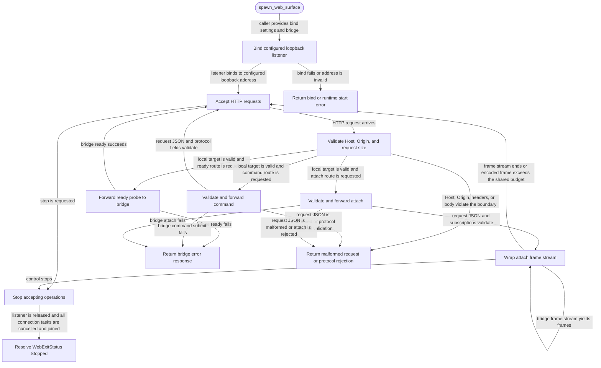

# web

<!-- selvedge-package-readme
package: selvedge-web
freshness_fingerprint: da20bab868e4ecf5e8e57d6721553f9d09e6c582
-->

This crate defines the localhost HTTP ingress boundary used by `selvedge-server`.

Use it to pass HTTP bind settings, bridge requests, bridge futures, attach frame streams, runtime state, start errors, bridge errors, and the web control handle across package boundaries.

`spawn_web_surface` binds the configured loopback address and keeps that listener owned by the web task. Port zero reserves an ephemeral port; `WebControl::local_addr` exposes the actual bound address. `WebControl` exposes the request handling core used by local HTTP routes: `ready` forwards readiness probes, `submit_command` validates and forwards command requests, and `attach` validates and wraps bridge frame streams.

`WebBridge` is implemented by `selvedge-server`. The web package forwards through that bridge and never touches router, events, database, or systemd state.

Each HTTP request requires one numeric-loopback `Host` header. `Origin` may be absent or use HTTP(S) with a numeric-loopback authority; duplicate or remote values are rejected. Hyper handles HTTP framing, including chunked requests and streaming responses. Request headers are capped at 16 KiB (HTTP 431 on overflow) and request bodies at 4 MiB. Header and body reads each have a five-second deadline.

Encoded attach items share `MAX_LOCAL_FRAME_BYTES` with the protocol and client: 4 MiB excluding the newline. Serialization stops at this budget. An oversized frame, including a snapshot, is replaced by a terminal `FrameTooLarge` stream error correlated to the attach command; no partial snapshot is sent. Large histories therefore fail attach explicitly until a future paging capability is introduced.

Stopping the web control moves the runtime to closing, stops accepting new control operations, releases the listener, and cancels every owned HTTP connection, including blocked bridge calls and writes. The join handle resolves with `WebExitStatus::Stopped` only after every connection task has joined.

## Package State Machine

The diagram records the package-level observable states and transition paths. Each edge label names the concrete condition checked at this package boundary.

