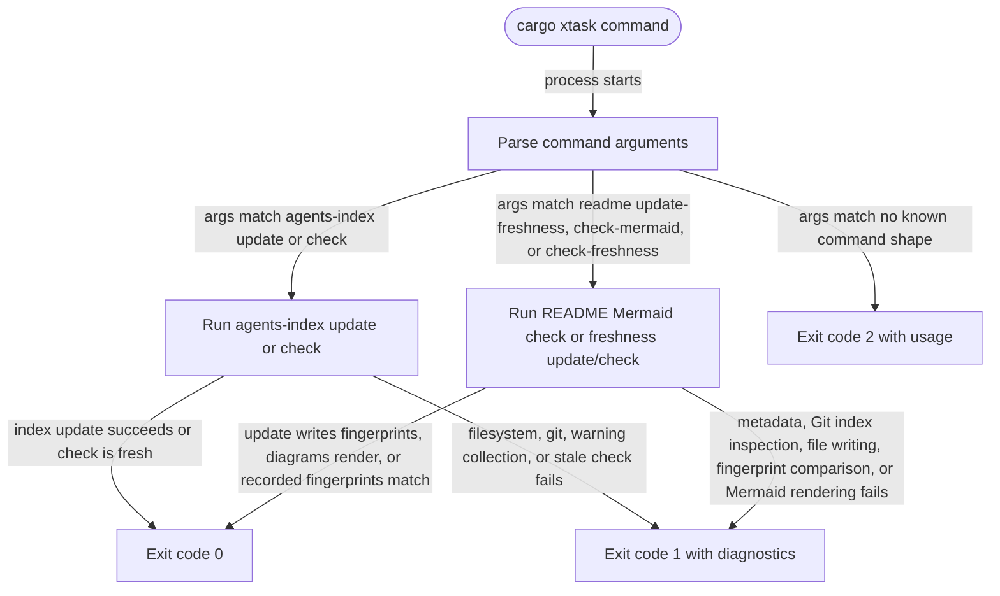

# xtask

<!-- selvedge-package-readme
package: xtask
freshness_fingerprint: 056e25277c6b2bc7431754d7d3859715c21eafa3
-->

`xtask` contains repository-local automation that should stay out of production crates.

## Commands

- `cargo xtask agents-index update` regenerates the AGENTS.md project index.
- `cargo xtask agents-index check` checks that the AGENTS.md project index is current.
- `cargo xtask readme check-mermaid` renders every package README Mermaid fence.
- `cargo xtask readme update-freshness` records a history-independent fingerprint of each package's tracked paths and staged blob ids, excluding its README.
- `cargo xtask readme check-freshness` compares each recorded fingerprint with the current Git index.

## Package State Machine

The diagram records the package-level observable states and transition paths. Each edge label names the concrete condition checked at this package boundary.

