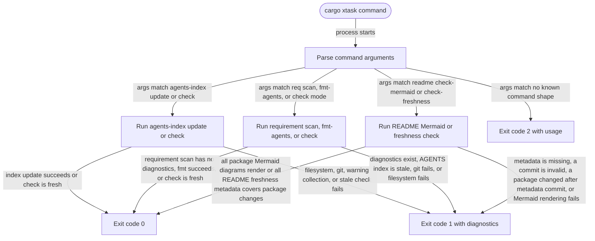

# xtask

<!-- selvedge-package-readme
package: xtask
freshness_commit: f2a0e6aa7f63b0fb8b575fefc5026e0535a7e64f
-->

`xtask` contains repository-local automation that should stay out of production crates.

## Requirement Commands

- `cargo xtask req scan` prints parsed requirement comments, their bindings, and diagnostics.
- `cargo xtask req fmt-agents` regenerates only the AGENTS.md requirement index block from source comments.
- `cargo xtask req check --staged` validates the staged Git snapshot for pre-commit.
- `cargo xtask req check --all` validates the full tracked checkout for CI.
- `cargo xtask req check --base <git-ref>` validates changed Rust hunks against a base ref for CI.
- `cargo xtask readme check-mermaid` renders every package README Mermaid fence.
- `cargo xtask readme check-freshness` checks package README freshness metadata against package-directory changes since the recorded commit, excluding the README file itself.

The requirement registry is in memory for one command invocation. AGENTS.md is the only generated tracked artifact.

## Package State Machine

The diagram records the package-level observable states and transition paths. Each edge label names the concrete condition checked at this package boundary.

